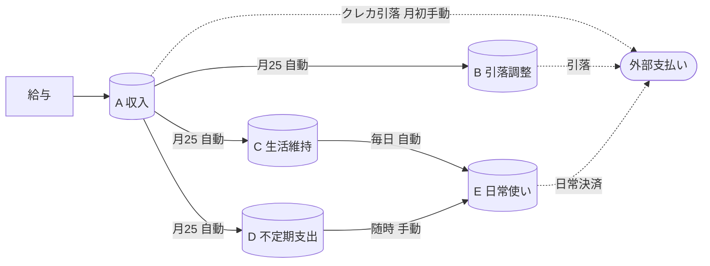
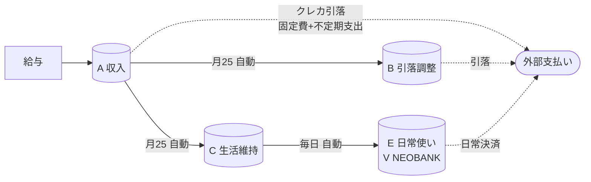

## 0. 給料日に全部使う人だった

正直に言うと、長らく「給料日に入った金額を月の半ばには空にして、給料日前の数日はご飯のことを本気で心配する」タイプだった。家計簿アプリは何度か入れ直したが、入力する手前で力尽きて、アイコンを長押しして消す、ということを何度か繰り返した。

意志でお金の出口を絞る方向は、自分には合っていないらしい。途中でそう諦めて、**自分の挙動を観測対象として扱う**方向に切り替えた。意志に期待するのをやめて、見える残高 = 使ってよい残高、という関係に作り変える。残高を見たら使う前提で、見たくないお金は別の場所に避難させておく。

ここから書くのは、2024 年の秋に組んだ 5 口座構成と、2 年経った 2026 年にひとつ畳んで、ひとつ役割が変わって、結果として全体が組み直された話。お金の話というより、自分を信頼しないところから始めた設計、と読んでもらう方が近い。

## 1. 設計の前提

具体に入る前に、前提を 3 つだけ。

**前提 1: クレカとデビットの役割をきっぱり分ける**

クレカは月次・年次の周期的な決済（サブスク・ふるさと納税など、金額が事前に決まっているもの）専用。日々の生活費は別口座のデビットから出す。

**前提 2: 同一銀行系で口座を固める**

口座を増やすと、口座間の移動に手数料と数営業日のタイムラグが乗ってくる。これが乗ると、月初に組んだ自動振込が「明日には間に合わない」となって設計が壊れる。同一銀行系で固められれば、口座間の移動は同一銀行内扱いになって手数料・タイムラグが消える。これがほぼ前提条件になっている。

ただし、個人で同一銀行に複数の独立口座を持つこと自体は、各行のルール（マネロン・詐欺対策の業界慣行）で基本的にできない。この設計は、住信 SBI ネット銀行の提携 NEOBANK 群（第一生命 / JAL / V / 三井住友信託 / d など、BaaS で住信 SBI の口座システムを使いつつ、口座番号は別の独立ブランド）を組み合わせることで成立している。同様の構成が他で組めるかは、2026 年現在ではかなり限定的。

**前提 3: 退避用の口座は「触る頻度が自然に下がる」場所に置く**

これは少し変わった選び方かもしれない。退避用の口座は、自分が日常的にアプリを開かなくて済む場所を選んでいる。「残高を見たくなったら見られる」状態だと、結局見にいって、結局使うことになる。手元のアプリで残高が目に入らない口座は、自分の中で「存在しない」のと近い扱いになる。

触る頻度が自然に下がる、というのを設計上の機能として置いている。

## 2. 5 つの口座の役割（2024 年の当初構成）

ここから本題。2024 年の秋に組んだ当初の構成はこうなっていた。**A → E に向かうにつれて、自分が触れる頻度が上がっていく**、というレイヤ構造になっている。

| ID | 役割 | 概要 |
|---|---|---|
| A | 収入集約 | 全収入の集約先。クレカの不定額引落もここから出ていく |
| B | 引落日調整 | 金額が決まっている定額引落の退避先 |
| C | 生活維持 | 最低限の食費が出るためのプール。飢えないための保険 |
| D | 不定期支出 | 月次の遊行費・雑多な買い物用の月予算 |
| E | 日常使い | ここに来たお金は全部使ってよい |

A〜D は退避層、E が日常使い、という区分けで、一番触りたい E は手元のメイン口座（住信 SBI 本体）、奥に行くほど普段アプリを開かない口座になる。残高を見て触りたくなる衝動が、奥に行くほど物理的に発生しにくくなる、という構造を作っている。

## 3. 自動振込で動く流れ

口座が用意できたら、あとは「誰がどこに、いつ、いくら動かすか」を全部 自動振込設定で固める。手で動かす場所が多いと、結局判断が要って、判断したら使う方に倒れる。

主な流れは以下の通り。

給与日は毎月 25 日（休業日は前営業日）。同日に A から、B（定額引落分の確保）/ C・D（定額振込）/ クレカ返済（不定額引落）に大半が散っていく。E（日常使い）には A から直接は流れず、C から日次の小遣いとして、D から随時の小遣いとして、薄く流れる仕組みになっている。月初に A 口座の残額を、繰上げ返済等に手動で吐き出す。

ここで効いているのは、**「給与日に全部使う」が物理的に不可能になる**こと。給与日には A の大半が散っていって、E に来るのは C 経由の日単位の小さい額だけになる。

**日次の小遣い振込**は補足。C → E に流れる 1 日あたりの額は最初、月の生活費を 30 で割って大きめに設定し、2 ヶ月ほど運用しながら実測で絞り、今の額に落ち着いた。月単位で残高と睨めっこするより、日単位で「今日のぶんは使い切った、明日まで待つ」と切り替えるほうが、自分には心理コストが軽かった。ゲームの「リチャージ感覚」に近い。

## 4. 2 年経って、組み直した

ここまでが当初の設計の話。2 年運用してみると、組み直したくなる箇所が見えてきた。

まず、D（不定期支出）の独立枠は畳んだ。不定期支出は全部クレカに寄せた。

D を畳んだ理由は、2 年運用しても**枠が機能しなかった**から。月によっては枠が足りなくて「今月はどうしても」と自分に言い訳をして使いすぎる。月によっては余って、結局使い切ってしまう。枠を切ることが縛りとして効いていない、という実態が見えてきて、諦めて畳んだ。

代わりに、不定期支出を全部クレカに寄せると、月末のクレカ請求額が **大きく見える** ようになる。「使いすぎの恐怖」が見える形で残高に乗ってくる方が、自分には縛りとして効きやすい。**自分を信頼しない方向は変わっていない。縛りの形を組み替えただけ**、というのが実態に近い。

もうひとつの変化は、V NEOBANK の役割転換のほう。メインのクレカを三井住友カードに切り替えたタイミングで、V NEOBANK 自体は退役させず、「不定期支出プール（D）」から「日常使いのデビット口座（E）」に役割を移した。ポイント設計の一本化が動機で、これは縛り設計の本筋から見ると副産物に近い。

**縛りの形を組み替えるなかで、最適化のレイヤも併走させられるようになった**。ポイント効率はその結果として乗ってきた、というのが構造上の本筋。

結果として、2026 年の構成はこうなった。

| ID | 役割 | 現状 |
|---|---|---|
| A | 収入集約 | 当初のまま |
| B | 引落日調整 | 当初のまま |
| C | 生活維持 | 当初のまま、保険として残置 |
| ~~D~~ | ~~不定期支出~~ | 独立枠は畳んだ（クレカに統合し「請求額の恐怖」で縛る） |
| E | 日常使い | V NEOBANK に再配置（ポイント設計の都合） |

D が消え、E への流れは C 経由 1 本だけになった。不定期支出はクレカに集約され、A → クレカ引落の矢印が「固定費 + 不定期支出」を背負う形になっている。

口座の数は 5 から 4 に減ったが、変化の本質は数の話より、**縛りの形を組み替えながら最適化のレイヤを併走させられるようになった**ことのほうにある。

## 5. 結局のところ

家計の話というより、**「考えなくていい状態を、意志ではなく構成で作る」**話だった、と書きながら自分でも思う。

意志で締めようとして失敗してきた人にとって、家計簿アプリの隣にもう 1 つ並べられる選択肢として、口座構成と自動振込の設計があるのではないかと思っている。いきなり 5 口座を組むのは重いので、まず収入集約用と日常使い用の 2 口座だけ分けて、自動振込を 1 本引くところから始められる。

2 年運用してみて、自分の挙動の方は思ったほど変わらなかった、というのも書き残しておきたい。変わったのは縛りの形のほう。**観測しながら縛りの形を組み替え続ける、そのなかで最適化のレイヤを併走させられるようになる**。この往復が起きる。仕組みは自分を変える触媒であって、変化の主因と断定はしない、という距離は残しておきたい。

これは家計に限った話ではなさそうで、仕事の進め方や、AI エージェントを使った業務の組み立て方でも、同じ「縛りの形を組み替えながら最適化を併走させる」往復が成立する場面に出会っている。
