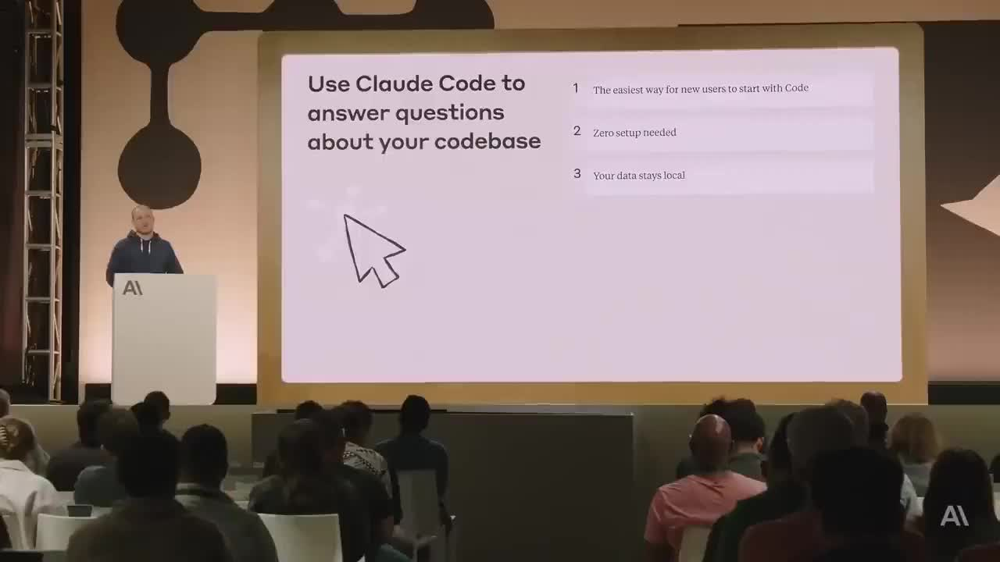
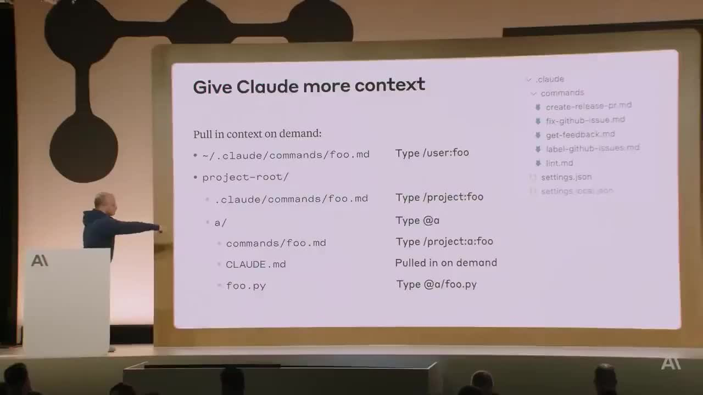

## はじめに

Anthropic のカンファレンスにて、Claude Code の作者である **Boris Cherny（Anthropic テクニカルスタッフ）** が登壇。Claude Code の設計思想・実践的な使い方・プライバシー保証について約 28 分にわたって解説しました。

---

## コアメッセージ：3 つの価値提案



登壇の中心にあったのはこのスライドです。

1. **新規ユーザーが最も簡単に Code を始められる方法**
2. **Zero setup（セットアップ不要）**
3. **Your data stays local（データはローカルに留まる）**

---

## プライバシー・セキュリティ

Claude Code のプライバシーについて明確なアピールがありました：

- コードは **リモートデータベースに保存されない**
- **クラウドにアップロードされない**
- コードは生成モデルの **トレーニングに使用されない**
- データは全て **ローカル環境に留まる**

企業コードベースへの適用を躊躇していた方にとって、特に重要なポイントです。

---

## Claude にコンテキストを与える



### コマンドファイルの仕組み

```
~/.claude/commands/foo.md        → /user:foo で呼び出す（個人用）

project-root/
  .claude/commands/foo.md        → /project:foo で呼び出す
  a/
    commands/foo.md              → /project:a:foo で呼び出す
    CLAUDE.md                    → オンデマンドで参照
    foo.py                       → @a/foo.py で参照
```

### コマンド例（`.claude/commands/` 配下）

- `create-release-pr.md` — リリース PR を自動作成
- `fix-github-issue.md` — GitHub Issue を自動修正
- `get-feedback.md` — フィードバックを取得
- `label-github-issues.md` — Issue に自動ラベル付け
- `lint.md` — リント実行

### 設定ファイルの使い分け

| ファイル | 用途 |
|---|---|
| `settings.json` | チーム全体で共有する設定（リポジトリにコミット） |
| `settings.local.json` | 個人用設定（リポジトリにコミットしない） |

:::message
`settings.json` をリポジトリにコミットするだけでチーム全体に設定を共有できます。オンボーディングの手間が大幅に削減されます。
:::

---

## 実践的な Tips

- **Escape キー** — セッションを安全に中断できる。ファイル操作中でもセッションが壊れたりしない
- **CLAUDE.md** — プロジェクト固有のコンテキスト（アーキテクチャの説明・開発規約など）を記述するファイル。オンデマンドで参照される
- **@ファイル参照** — `@a/foo.py` のように直接ファイルを指定してコンテキスト渡しができる
- **チーム共有** — `settings.json` 1 ファイルをコミットするだけでワークフローを共有

---

## Q&A ハイライト


- **マルチモーダル機能について:** 現在の認識を超える機能があるか確認する質問が寄せられた
- **セッションの中断・再開について:** Escape で安全に中断でき、状態が壊れないことを実演
- **チーム共有ワークフローについて:** `settings.json` によるチーム設定共有の詳細な質問があった

---

## まとめ

| ポイント | 内容 |
|---|---|
| 🔒 プライバシー | コードはローカルのみ・クラウド送信なし・学習不使用 |
| ⚡ 導入のしやすさ | Zero setup。すぐ使い始められる |
| 📁 コンテキスト管理 | CLAUDE.md・コマンドファイル・@参照で精度向上 |
| 👥 チーム活用 | settings.json 1 ファイルでワークフロー共有 |
| 🛡️ 安全性 | Escape で安全中断・セッションが壊れない設計 |

Claude Code はセキュリティ面の透明性と使いやすさを両立させた設計になっており、個人開発者からエンタープライズチームまで幅広く活用できます。

---

## 📝 全文書き起こし（日本語訳）

> 5分ごとのチャンクで書き起こしを行っています。音声認識による誤記は訳出時に修正しています。

**[0:00]**

みなさんこんにちは。Boris です。Anthropic のテクニカルスタッフで、Claude Code を作りました。今日は Claude Code を使う上での実践的なヒントとコツをいくつかお話ししたいと思います。非常に実践的な内容にする予定で、歴史や理論には深入りしません。

さて始める前に、Claude Code を使ったことがある方、手を挙げてもらえますか？ ありがとう、そうですね、いい感じです。手を挙げなかった方へ——人が話している最中にやるべきことではないとわかっていますが、もしラップトップを開いてこのコマンドを入力できるなら、Claude Code をインストールできます。残りのトークに沿って使えるようになるので、ぜひ。

さて、Claude Code とは何か。Claude Code は新しい種類の AI アシスタントです。コーディング用 AI アシスタントにはいくつかの世代があって、ほとんどは1行ずつ、数行ずつ補完するものでした。Claude Code はそういう使い方のためのものではなく、**完全にエージェント型**です。機能全体を実装したり、関数やファイル丸ごと書いたり、バグ全体を同時に修正するためのものです。

Claude Code のいいところは、既存のツールをそのまま使えることです。ワークフローを変える必要はありません。VS Code でも Xcode でも JetBrains でも使えます。「俺の IDE は絶対離さない」という人も Claude Code を使っています。なぜなら Claude Code はあらゆる IDE・あらゆるターミナルで動くからです。ローカルでも、リモート SSH でも、tmux 経由でも、どんな環境でも動きます。

汎用ツールなので、こういった自由形式のアシスタントを使ったことがない人には、最初どこから始めればいいかわかりにくいかもしれません。開いてみるとプロンプト入力欄があるだけで、「これで何をするの？」と思うかもしれない。パワーツールなので色々なことに使えますが、だからこそ特定のワークフローへ誘導しようとはしていません。エンジニアとして好きなように使えるべきだからです。

Claude Code を初めて開いたとき、環境セットアップとしていくつかやっておくべきことがあります。

- `/terminal-setup` を実行 → Shift+Enter で改行できるようになります
- `/theme` でライトモード・ダークモード・色覚サポートテーマを設定
- `/install-github-app` → 今日発表した GitHub App をインストール。GitHub の Issue やプルリクエストに Claude を @メンションできるようになります
- 許可ツールのカスタマイズ → よく使うコマンドを毎回承認しなくて済むようになります

個人的にやっているのは、プロンプトを手入力する代わりに音声入力を使うことです。macOS のシステム設定 → アクセシビリティ → ディクテーションを有効にして、ディクテーションキーを2回押すだけで話しかけられます。具体的なプロンプトをしゃべるのにとても使いやすい。別のエンジニアに話しかけるように Claude Code と対話できます。

Claude Code を使い始めるとき、何から始めればいいか。**まず絶対おすすめなのはコードベースへの Q&A です**。コードについて質問するだけ。これは Anthropic の新入社員に教えていることです。技術系のオンボーディング初日に Claude Code をダウンロードしてセットアップして、すぐにコードベースへの質問を始めます。以前は技術オンボーディングでチームへの負荷が大きかった——他のエンジニアに質問したり、コードを読み漁ったり、ツールの使い方を覚えたりで時間がかかりました。Claude Code があれば、コードベースを探索しながら答えてくれます。Anthropic の技術系オンボーディングはかつて2〜3週間かかっていたのが、今は2〜3日になりました。

Q&A のもう一つのいい点は、**インデキシングが一切ない**ことです。

---

**[5:00]**

コードがリモートデータベースに保存されることはありません。どこかにアップロードされることもありません。コードはローカルにあります。生成モデルのトレーニングには使われません。あなたがコントロールできます。インデックスも何もない。つまりセットアップも不要です。ダウンロードして起動すれば、インデキシングを待つことなくすぐ使えます。

今日は技術的な話なので、具体的なプロンプトとコードサンプルをお見せします。聞けるような質問の例を挙げると——「このコードの使われ方は？」「このクラスをどうインスタンス化すればいい？」などです。Claude Code は単純なテキスト検索で答えるのではなく、一段深く入って、クラスがどのようにインスタンス化されているか実例を探し、より深い答えを返します。Cmd+F の代わりに、1週間かけて読むようなドキュメントに相当する答えが得られます。

**git 履歴についての質問もよくします。**「なぜこの関数に引数が15個あるのか？なぜこんな変な名前がついているのか？」——どのコードベースにもそういう関数やクラスがありますよね。Claude Code は git 履歴を調べて、それらの引数がどのように導入されたか、誰が入れたか、どんな状況だったか、どの Issue とリンクするコミットかを調べてまとめてくれます。細かく指示しなくても「git 履歴を調べて」と言うだけで理解して動いてくれる。これはシステムプロンプトで指示しているからではなく、モデル自体が優秀だからです。

**GitHub の Issue についても聞きます。**Web フェッチを使って Issue を取得してコンテキストを積んでくれます。毎週月曜のスタンドアップで「今週何をリリースしたか」を聞いています。Claude Code が git ログを見て私のユーザー名を把握し、リリースした内容を整理して出してくれるので、それをドキュメントツールにコピーするだけです。

**Tip その1** — Claude Code を使ったことがない人・チームにオンボーディングするとき、最初は必ずコードベース Q&A から始めてください。いきなりツールを使ったりコードを編集したりしないで、まず質問するだけ。それでプロンプトの書き方が身につき、「Claude Code に何ができるか・何が1ショットでいけるか・何がインタラクティブモードを必要とするか」という境界感覚が育ちます。

Q&A に慣れたら次はコード編集です。エージェント的に LLM を使うことの面白さは、ツールを渡すと魔法のように使い方を理解してくれることです。Claude Code に与えるツールはそれほど多くありませんが——ファイル編集・bash コマンド実行・ファイル検索——それを組み合わせてコードを探索し、ブレインストーミングして、編集を行います。「このツールを使え、次にそのツールを使え」と指示しなくても、「これをやって」と言えば適切につなぎ合わせてくれます。

**プランニングを先にさせる**のも私がよくやることです。「実装に入る前に計画を立ててから承認を求めて」と言うだけでいい。プランモードや特別なツールは不要です。3000行規模の機能を一発で投げると、意図しないものを作ることがある。まず考えさせることで、欲しいものが得られる確率が大幅に上がります。

**「コミットしてプッシュして」** という呪文もよく使います。特別なことは何もない。Claude Code は賢いので、ブランチを作り、コミットを作り、GitHub にプルリクエストを作ってくれます。コードを見て、履歴を見て、git ログからコミットフォーマットを自分で判断して、適切な方法でコミット・プッシュします。これもシステムプロンプトで指示しているわけではなく、モデルが優秀なだけです。

ある程度慣れてきたら、チームのツールを組み込んでいきたくなります。ここで Claude Code が本当に輝き始めます。ツールには大きく2種類あります。

---

**[10:00]**

一つ目はコマンドラインツール（CLI）です。たとえば何かの CLI を使いたいとき、「このツールを使って〇〇して」と伝えればいい。`--help` フラグでツールの使い方を自分で調べてくれます。よく使うなら CLAUDE.md に書いておけば、セッションをまたいで覚えてくれます。

二つ目は **MCP ツール**です。Anthropic 内でも外部のお客様でも同じパターンを使っています。MCP ツールを追加して、使い方を伝えるだけで使い始めます。新しいコードベースで Claude Code を使い始めるとき、チームがすでに使っているツールをすべて渡せば、Claude Code がそれを代わりに使ってくれます。

**よくあるワークフロー:**
- 探索 → 計画 → コード書く前に確認を求める
- フィードバックループを与える（ユニットテスト・Puppeteer スクリーンショット・iOS シミュレータのスクリーンショットなど）と、Claude Code は自分で反復します。モックを渡して「このウェブ UI を作って」と言うと最初の出力でかなりいい感じになりますが、2〜3回反復させるとほぼ完璧になります。**何らかの方法で自分の結果を確認できるツールを与えること**が重要です。

ツールの次は **コンテキストを与えること**です。コンテキストが多いほど、判断が賢くなります。エンジニアとして自分のシステムや歴史について頭の中に大量のコンテキストを持っている——それを Claude Code に渡す方法はいくつかあります。

最もシンプルなのは **CLAUDE.md** です。プロジェクトのルートに置くと、セッション開始時に自動で読み込まれます。個人用の `CLAUDE.md.local`（ソース管理にコミットしない）も使えます。

CLAUDE.md に書くべきもの：よく使う bash コマンド・MCP ツール・アーキテクチャの決定事項・重要なファイル。ただし**短く保つこと**。長すぎるとコンテキストを食いすぎて逆効果になります。Anthropic のコードベースでは、よく使う bash コマンド・スタイルガイド・主要ファイルを書いています。

ネストしたディレクトリに CLAUDE.md を置くと、そのディレクトリで作業するときにオンデマンドで読み込まれます。エンタープライズなら複数コードベースで共有する CLAUDE.md を管理することもできます。

コンテキストを引き込む別の方法が **スラッシュコマンド（/commands）** です。ホームディレクトリかプロジェクトに置けます。Claude Code リポジトリ自体にも例があります——`label-github-issues` は GitHub Action から実行されるスラッシュコマンドで、Issue を自動でラベル付けしています。人間がやらなくて済む。

ファイルを `@` でメンションしてコンテキストに引き込むこともできます。

---

**[15:00]**

サブディレクトリの CLAUDE.md は、Claude Code がそのディレクトリで作業するときに自動で読み込まれます。コンテキストをチューニングする時間を取ることは非常に価値があります。「誰のためのコンテキストか」「毎回入れるか・オンデマンドか」「チームで共有するか・個人用か」を考えながらチューニングすると、パフォーマンスが劇的に向上します。

より高度になると、コンテキストの**階層構造**を意識したくなります。CLAUDE.md だけでなく、設定全体をこの階層的な方法で引き込めます：

- **プロジェクト固有** — Git リポジトリに紐づく。コミットするかどうか選べる
- **グローバル設定** — 全プロジェクト共通
- **エンタープライズポリシー** — 組織全員に自動適用するグローバル設定

このスライドは情報量が多いですが、要点は「これはいろいろなものに適用できる」ということです。スラッシュコマンドにも、パーミッションにも使えます。たとえば全従業員が使うテストコマンドをエンタープライズポリシーに書いておけば、実行時に自動承認されます。逆に「このURLは絶対にフェッチさせない」というブロックにも使えます。

MCP サーバーについても同様です。`mcp.json` をコードベースにコミットしておけば、誰かがそのコードベースで Claude Code を起動したとき、MCP サーバーのインストールを促されてチームで共有できます。

どれを使えばいいかわからない場合は、**まず共有プロジェクトコンテキスト（CLAUDE.md）から始めること**をおすすめします。一度書けばチーム全体に共有でき、誰かが少し作業すれば全員が恩恵を受けるネットワーク効果が生まれます。

`/memory` を実行すると、現在読み込まれているメモリファイルを一覧で確認できます。エンタープライズポリシー・ユーザーメモリ・プロジェクト CLAUDE.md・ネストした CLAUDE.md など。`/memory` から特定のメモリファイルを編集したり、`#` で「これを覚えて」と指示したときにどのメモリに書き込むか選んだりできます。

Anthropic のアプリリポジトリでは Puppeteer の MCP サーバーをチームで共有しています。`mcp.json` に設定があるので、そのリポジトリで作業するエンジニアは誰でも Puppeteer を使ってテストを自動化したりスクリーンショットを撮ったり反復できます。全員が個別にインストールしなくて済む。

---

ここでプロ向けのキーバインドをいくつか紹介します。ターミナル向けにビルドするのは難しいですが、新しいデザイン言語を再発見するようで楽しくもあります。ターミナルは極めてミニマルなので、キーバインドを発見しにくいことがあります。

| キー | 機能 |
|---|---|
| `Shift+Tab` | 編集の自動承認モードに切り替え（bash コマンドは引き続き承認が必要） |
| `#` + テキスト | Claude Code に何かを記憶させる。CLAUDE.md に自動で書き込まれる |
| `!` + コマンド | bash モードに落としてコマンドを実行。コンテキストウィンドウにも入り Claude Code が次のターンで見られる |
| `Escape` | Claude Code の動作を安全に中断。セッションは壊れない |
| `Escape` × 2 | 履歴を遡る |
| `--resume` / `--continue` | セッション終了後に再開する |
| `Ctrl+R` | Claude Code のコンテキストウィンドウと同じ全出力を表示 |

たとえばユニットテストを書いて反復しているとき、Claude Code が正しい方向に進んでいるなら `Shift+Tab` で自動承認モードに切り替えます。毎回 OK を押さなくて済む。

---

**[20:00]**

何をしていても `Escape` で安全に止められます。セッションが壊れたりしません。21個の編集を提案されたとして、19個は完璧だけど1箇所変えたい——Escape で止めて、その1箇所を伝えてやり直させればいい。

次は **Claude Code SDK** についてです。`-p` フラグを使ったことがあれば、それが SDK です。ここ数週間でさらに多くの機能を追加してきました。

```bash
claude -p "プロンプト" --allowedTools "Bash(git status)" --output-format json
```

CLI SDK として、プロンプトを渡して、許可するツールを指定して、出力フォーマットを JSON やストリーミング JSON で受け取れます。Claude Code 自体がこの同じ SDK を使っています。

パイプも非常に便利です：

```bash
git status | claude -p "変更内容を要約して" | jq '.result'
```

「超知的な Unix ユーティリティ」のような新しい考え方です。GCP バケットから巨大なログを読み込んでパイプで渡して「このログで何が重要か」を判断させることもできます。Sentry CLI からデータを取得してパイプで渡すことも。組み合わせは無限です。まだ可能性の表面しか引っ掻いていないと思います。

最後に、最も高度なユースケースとして——私は「Claude Code 軍団」的な使い方をしています。通常1つの Claude Code を動かしつつ、いくつかのターミナルタブで別々のリポジトリを動かしています。Anthropic 内外のパワーユーザーを見ると、ほぼ必ず SSH セッションや tmux で複数の Claude Code セッションを持ち、同じリポジトリを複数チェックアウトして並列に走らせたり、Git ワークツリーで分離しながら動かしています。

使いやすくするために積極的に開発中ですが、今でも並列でかなりの量の作業ができます。セッション数に制限はないので、並列でやり遂げられることがたくさんあります。

Q&A の時間も取りたいと思います。両サイドにマイクがありますので、質問があればどうぞ。

**（拍手）**

---

**Q&A**

**Q: Claude Code を作る上で、実装が最も難しかったのはどこですか？**

難しい部分はたくさんありますが、特にトリッキーだったのは **bash コマンドを安全にする仕組み**です。bash は本質的に危険で、システムの状態を予期しない形で変更できます。かといって bash コマンドを毎回手動承認するのはエンジニアにとって非常に煩わしく、生産性が落ちます。

「どのコマンドは読み取り専用か」「どのコマンドを安全に組み合わせられるか」を静的解析で判断し、コマンドを複数のレベルで許可・ブロックできる複雑な階層型パーミッションシステムに落ち着きました。Docker コンテナで動かしていない人も多いので、様々なコードベースにスケールする方法を見つけるのが難しかった。

---

**[25:00]**

**Q: 画像を Claude Code に渡すとおっしゃっていましたが、マルチモーダル機能があるのですか？**

はい。**Claude Code は最初からフルマルチモーダルです。** ターミナルなので発見しにくいですが、画像をドラッグ＆ドロップで渡せますし、ファイルパスを渡しても、コピー＆ペーストしても動きます。モックがあれば、ドラッグ＆ドロップして「これを実装して」と言い、UI サーバーと組み合わせて反復させます。

**Q: なぜ IDE ではなく CLI ツールとして作ったのですか？**

2つ理由があります。1つ目は、Anthropic では様々な IDE を使う人がいます——VS Code、Vim、Xcode、Emacs。全員にとって動くものを1つ作るのが難しかった。ターミナルが共通の基盤です。

2つ目は、Anthropic にいるとモデルがどれほど速く良くなっているかを間近で見ています。数年後にはみんな IDE を使っていないかもしれない、という可能性は十分あります。そういう未来に備えて、UI や上乗せのレイヤーに過度に投資することを避けたかった。モデルの進化の速さを考えると、そこに投資しても無駄になるかもしれない。

**Q: Claude Code を機械学習・モデリングにどれくらい使っていますか？**

かなり使っています。Anthropic のエンジニアも研究者も毎日使っています。技術系の人の約 **80%** が毎日 Claude Code を使っています。それがプロダクトへの愛情とドッグフーディングの結果として製品に反映されていることを感じ取ってもらえれば嬉しいです。研究者はノートブックツールを使って Jupyter Notebook の編集や実行にも活用しています。

ありがとうございました。
