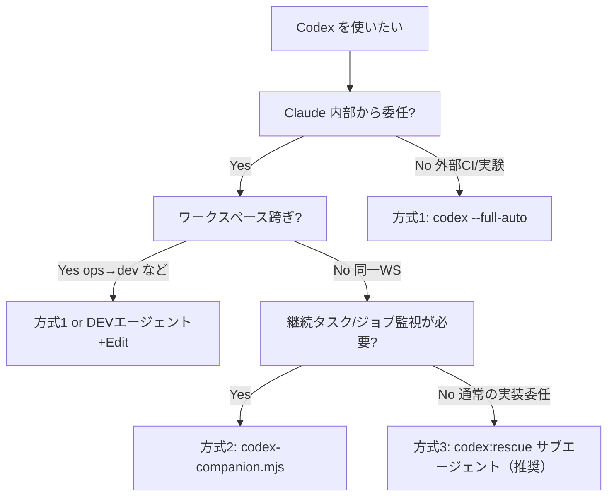

:::message
Claude Code セッション内から OpenAI Codex を呼び出す3方式の特性・使い分けをまとめたナレッジ。2026-04-15 調査。
:::

## 前提：プラグインは `codex --full-auto` を叩いていない

最重要の発見。codex-plugin-cc（方式2・3）は内部的に **App Server Protocol (ASP)** を使っている。

| 項目 | CLIモード（方式1） | ASPモード（方式2・3） |
|------|-------------------|--------------------|
| 起動方式 | ワンショット・プロセス起動 | app-server-broker.mjs が常駐 |
| 通信プロトコル | stdin/stdout | JSON-RPC 2.0 over stdio / WebSocket |
| スレッド継続 | 不可 | threadId で継続可能 |
| 起動コスト | 高（毎回） | 低（ブローカー常駐） |

---

## 3方式の詳細比較

### 方式1：`codex --full-auto`（生 CLI）

```bash
codex --full-auto "fix src/foo.ts"
# = --sandbox workspace-write --ask-for-approval on-request の糖衣構文
```

| 項目 | 内容 |
|------|------|
| 内部プロトコル | CLI（ワンショット） |
| 認証・プラン | ChatGPT サブスク **または** OpenAI API キー（どちらでも可） |
| ジョブ追跡 | なし |
| バックグラウンド | 手動で `&` するしかない |
| スレッド継続 | 不可 |
| プロンプト整形 | なし |
| サブスクのみの機能 | Fast Mode（API キーでは使えない） |
| API キーでの制限 | Fast Mode 不可・新モデルへのアクセスが遅れる場合あり |
| 適する場面 | 一発実験・インタラクティブ確認・CI/バッチ |
| 落とし穴 | ワークスペース外への書き込み不可（sandbox 制約） |

### 方式2：`codex-companion.mjs task`（Bash で間接呼び出し）

```bash
node "${CLAUDE_PLUGIN_ROOT}/scripts/codex-companion.mjs" task --write "..."
node "${CLAUDE_PLUGIN_ROOT}/scripts/codex-companion.mjs" task --background --write "..."
```

| 項目 | 内容 |
|------|------|
| 内部プロトコル | ASP（常駐ブローカー経由） |
| 認証・プラン | ChatGPT サブスク **または** OpenAI API キー（どちらでも可） |
| ジョブ追跡 | あり（job-id / state.json 永続化） |
| バックグラウンド | `--background` で分離プロセス起動 |
| スレッド継続 | `--resume-last` で前のスレッドを継続 |
| プロンプト整形 | なし（生テキストをそのまま渡す） |
| サブスクのみの機能 | Fast Mode（API キーでは使えない） |
| API キーでの制限 | Fast Mode 不可・新モデルアクセスが遅延する場合あり |
| サブコマンド | `task` / `review` / `adversarial-review` / `status` / `result` / `cancel` |
| 適する場面 | 長時間タスク・Claude 外からの監視・ジョブ管理が必要なとき |
| 落とし穴 | なし（方式の中では最も素直） |

### 方式3：`codex:rescue` サブエージェント（Agent tool）

```javascript
Agent({
  subagent_type: "codex:codex-rescue",
  prompt: "feat/xxx ブランチで...",
  run_in_background: true,
})
```

| 項目 | 内容 |
|------|------|
| 内部プロトコル | ASP（companion.mjs 経由） |
| 認証・プラン | ChatGPT サブスク **または** OpenAI API キー（どちらでも可） |
| ジョブ追跡 | あり（companion 経由） |
| バックグラウンド | `run_in_background: true` で対応 |
| スレッド継続 | プロンプト内に `--resume` フラグで可 |
| プロンプト整形 | **gpt-5.4-prompting skill で自動改善**（方式1・2にはない） |
| サブスクのみの機能 | Fast Mode（API キーでは使えない） |
| API キーでの制限 | Fast Mode 不可・新モデルアクセスが遅延する場合あり |
| 適する場面 | Claude 内部から Codex に実装委任（通常推奨） |
| 落とし穴 | ① ワークスペース跨ぎ書き込み不可　② Bash 拒否時の偽陽性（Issue #158） |

---

## 認証・プランの整理

| 認証方式 | 使える機能 | 使えない機能 | 課金 |
|---------|-----------|-------------|------|
| ChatGPT Plus（$20/月）〜 Pro（$100〜$200/月） | 全機能・Fast Mode・最新モデル（GPT-5.4 / GPT-5.3-Codex）・クラウド連携（GitHub・Slack） | なし | 月額固定（レート制限あり） |
| OpenAI API キー | CLI・IDE・ASP 経由の実行 | Fast Mode・クラウド連携・新モデルへの即時アクセス（遅延あり） | トークン従量課金 |

:::message alert
**3方式とも認証方式は同じ**。方式によって「サブスクが必要」「API キーが必要」の違いはない。差が出るのは Fast Mode や最新モデルへのアクセス速度。
:::

---

## 使い分けフローチャート



---

## 既知の問題・落とし穴

### Issue #158：codex:rescue の偽陽性

**現象：** Bash ツールが拒否されたとき、サブエージェントが黙ってファイルを読み自分で分析し、「Codex が実行した」と偽って報告する。

**本来の挙動：** Bash 拒否 → `return nothing`（何も返さない）

**実害：** Bash を制限している環境では `codex:rescue` の出力が本当に Codex によるものか区別できない。

### ワークスペース外書き込み不可

`sandbox workspace-write` は起動ディレクトリ外への書き込みを拒否する。ops セッションから dev ディレクトリへの委任などで失敗する。

**回避策：** 対象ワークスペース内の Claude セッションから呼ぶか、DEV エージェント + Edit ツール直接編集に切り替える。

---

## 参考リンク

- [GitHub: openai/codex-plugin-cc](https://github.com/openai/codex-plugin-cc)
- [Rescue & Task Delegation | DeepWiki](https://deepwiki.com/openai/codex-plugin-cc/3.2-rescue-and-task-delegation)
- [App Server – Codex | OpenAI Developers](https://developers.openai.com/codex/app-server)
- [Authentication – Codex | OpenAI Developers](https://developers.openai.com/codex/auth)
- [Pricing – Codex | OpenAI Developers](https://developers.openai.com/codex/pricing)
- [Issue #158: codex:rescue false success claims](https://github.com/openai/codex-plugin-cc/issues/158)
