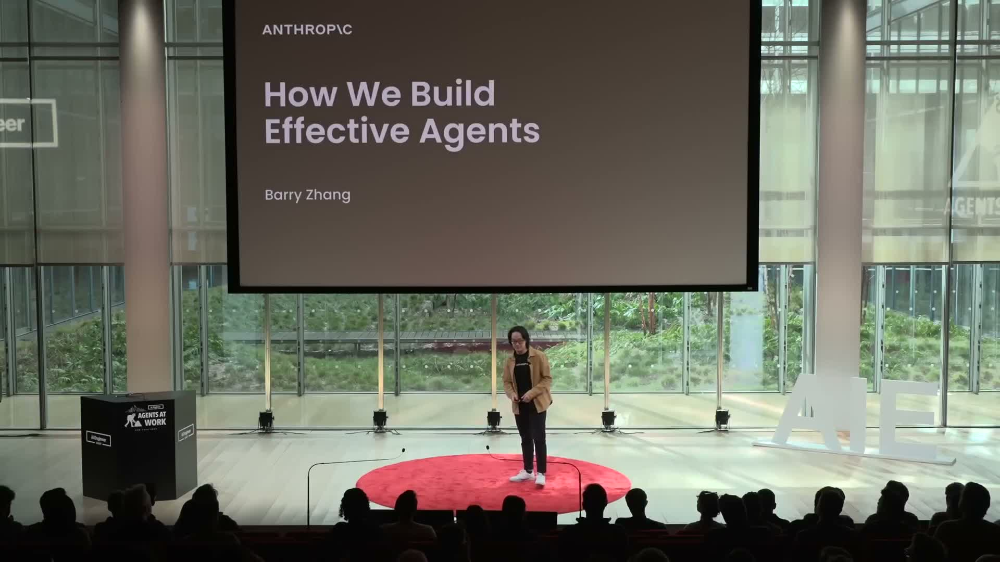
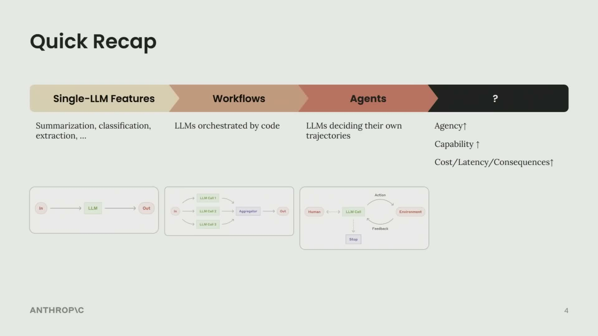
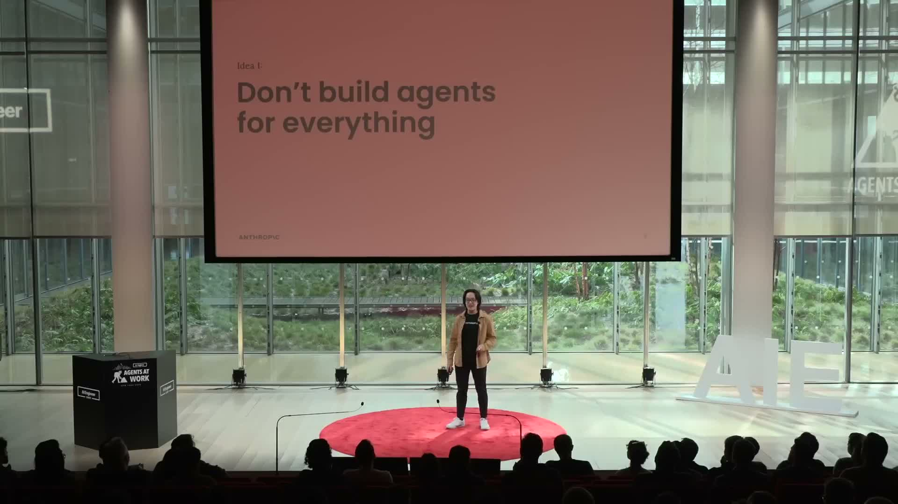
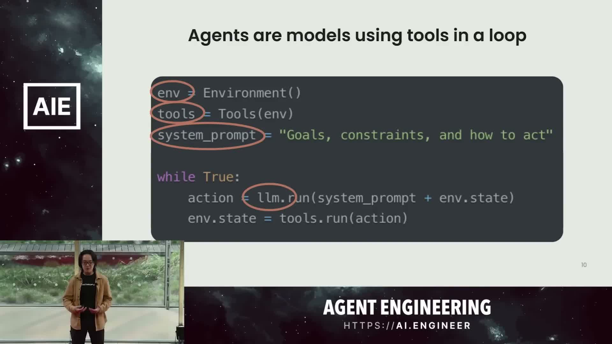
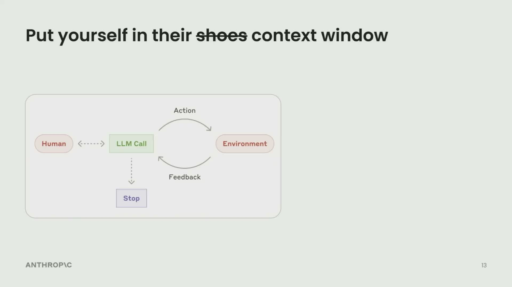

:::message
この記事の情報は 2026年4月時点のものです。
:::

> **出典:** この記事は [@Ronycoder](https://x.com/Ronycoder/status/2048649743602237493) がXに投稿した約15分の動画をもとにまとめたものです。登壇者はAnthropicのBarry Zhang氏。「Agents at Work」イベントでの講演内容です。

## はじめに

AnthropicのBarry Zhang氏はEric氏とともに、ブログ記事「Building Effective Agents」を執筆した人物だ。この講演ではそのブログ記事の核心にある3つのアイデアをさらに深掘りし、エージェント開発における実践的な知見を共有している。



**3つの原則:**

1. すべてにエージェントを使うな
2. シンプルに保て
3. エージェントの視点で考えろ

## AIシステムの進化

まずBarry氏は、AIシステムがどう発展してきたかを整理した。



| フェーズ | 概要 |
|---|---|
| **Single-LLM Features** | 要約・分類・抽出など、1回のLLM呼び出しで完結するシンプルな機能 |
| **Workflows** | 複数のLLM呼び出しをコードで制御する事前定義フロー。コストと精度のトレードオフを管理できる |
| **Agents** | LLM自身が軌跡を決定し、環境からのフィードバックをもとにほぼ自律的に動作するシステム |
| **次のフェーズ（?）** | より汎用的な単体エージェント、またはマルチエージェント協調 — どちらに向かうかはまだ未知数 |

方向性は明確だ。エージェントにより多くの自律性を与えるほど、有用性と能力は上がる。しかし同時に、コスト・レイテンシ・エラーの影響も大きくなる。この緊張関係こそが、以降の3原則の根拠になっている。

## 原則1: すべてにエージェントを使うな

エージェントは「複雑で価値の高いタスクをスケールさせるための手段」であり、あらゆるユースケースへのドロップイン置き換えではない。ではいつ使うべきか? Barry氏は4項目のチェックリストを示した。



### チェック1: タスクの複雑さ

エージェントが真価を発揮するのは、**曖昧で複雑な問題空間**だ。デシジョンツリーを自分で書き出せるなら、その通りに明示的に実装してしまった方がよい。コスト効率が高く、制御もしやすい。

### チェック2: タスクの価値

エージェントはトークンを大量に消費する。「1タスク10セント以内に収めたい」という制約があるなら、使えるのは30〜50トークン相当に過ぎない。そういったケースでは、最頻出シナリオをワークフローで処理するだけで大半の価値を回収できる。

逆に「何トークン使ってもいいからとにかくタスクを完遂したい」と思うなら、エージェントの出番だ。

### チェック3: 重要機能のボトルネック確認

エージェントを走らせる前に、軌跡上の重大なボトルネックがないか確認する。コーディングエージェントなら、コードを書けるか・デバッグできるか・エラーから回復できるかが問われる。ボトルネックがあっても致命的ではないが、コストとレイテンシが倍増する。その場合はスコープを絞って出直す。

### チェック4: エラーのコストと発見しやすさ

エラーが高リスクで発見しにくい場合、エージェントに自律的な行動を委ねるのは難しい。読み取り専用アクセスやHuman-in-the-Loopで軽減はできるが、それはスケーラビリティとのトレードオフになる。

### なぜコーディングは良いユースケースなのか

Barry氏はコーディングエージェントを例に、このチェックリストを適用してみせた。

- **複雑さ**: 設計ドキュメントからPRまでは、明らかに曖昧で複雑
- **価値**: 開発者にとってコードの価値は言うまでもない
- **能力**: モデルはすでにコーディングの多くの工程が得意
- **検証のしやすさ**: ユニットテストとCIで出力を機械的に検証できる

この「出力が自動検証可能」という性質が、コーディングエージェントの成功例が多い理由の一つだとBarry氏は指摘する。

## 原則2: シンプルに保て

「エージェントとは、ツールをループで使うモデルのことだ」

Barry氏はエージェントをこの一文で定義し、構成要素を3つに絞り込んだ。



```python
env = Environment()
tools = Tools(env)
system_prompt = "Goals, constraints, and how to act"

while True:
    action = llm.run(system_prompt + env.state)
    env.state = tools.run(action)
```

| コンポーネント | 役割 |
|---|---|
| **Environment** | エージェントが動作するシステム（ファイルシステム、ブラウザ、APIなど） |
| **Tools** | エージェントがアクションを取り、フィードバックを得るためのインターフェース |
| **System Prompt** | エージェントのゴール・制約・振る舞いの定義 |

コーディングエージェント・サーチエージェント・Computer Useエージェント——見た目は全く異なるが、Anthropic社内ではこれらがほぼ**同じコードのバックボーン**で実装されているという。Environmentに依存する部分と、ToolsとSystem Promptの設計だけが変わる。

### 複雑さは反復速度を殺す

Barry氏が「シンプルに」と強調するのは経験則による。序盤の余計な複雑さは反復速度を大幅に落とす。まずこの3つのコンポーネントを作り、動作が安定してから最適化に移る。

具体的な最適化の例:
- **コーディング/Computer Use**: ディレクトリをキャッシュしてコスト削減
- **サーチ（多数ツール）**: ツール呼び出しを並列化してレイテンシ削減
- **全般**: エージェントの進捗をユーザーに見せてトラストを獲得

## 原則3: エージェントの視点で考えろ

「Put yourself in their ~~shoes~~ context window（エージェントの靴ではなくコンテキストウィンドウに入れ）」



モデルは一見、非常に高度な推論をしているように見える。だが各ステップで実際にやっていることは、**10〜20Kトークンの限られたコンテキストに対して推論を走らせているだけ**だ。モデルが世界について知っていることは、すべてそのコンテキストウィンドウに収まっている。

Barry氏はエージェントの視点を体感する実験として、Computer Useの例を挙げた。

---

「あなたは今、Computer Useエージェントです」

渡されるのは静止画スクリーンショットと、ひどく説明不足なテキスト説明だけ。ツールを使うことでしか環境に影響を与えられない。クリックを試みても、推論とツール実行が走っている間は何も見えない。それは**3〜5秒間、目を閉じたままコンピュータを操作する**に等しい。

目を開けたとき、新しいスクリーンショットが渡される。あなたのクリックが成功したのか、誤ってコンピュータをシャットダウンしたのかも分からない。

---

この実験をやると、エージェントが本当に必要としているものが自然と見えてくるとBarry氏は言う。

- スクリーン解像度（どこをクリックすべきかを知るために）
- 推奨アクションと制約（不必要な探索を防ぐガードレール）

### ClaudeにClaudeを評価させる

実用的なテクニックとして、エージェントの軌跡全体をClaudeに投げて尋ねるという方法が紹介された。

> 「なぜここでこの判断をしたと思うか? より良い判断をするために何を提供できるか?」

System Promptをそのままモデルに渡して「どこか曖昧な点があるか? 従えるか?」と確認することも有効だ。自分自身の理解を代替するものではないが、エージェントの視点に近づくための強力な補助線になる。

## 今後の3つのオープンクエスチョン

講演の最後にBarry氏は、AIエンジニアとして常に頭の中にある未解決問題を3つ挙げた。

**1. エージェントへの予算意識の付与**

ワークフローと異なり、エージェントのコストとレイテンシは把握しにくい。時間・金額・トークン数で「予算」を定義・適用する仕組みが整えば、本番投入できるユースケースが大幅に広がる。

**2. セルフエボルビングツール**

すでにモデルを使ってツールの説明文を改善することはできている。これを一般化して、エージェント自身が各ユースケースに必要なツールを設計・改善するメタツールに発展させる——そうすればエージェントの汎用性は飛躍的に高まる。

**3. マルチエージェント協調**

Barry氏は「2026年末までに、本番でのマルチエージェント協調事例が大幅に増える」と確信している。並列化・関心の分離・サブエージェントによるメインエージェントのコンテキストウィンドウ保護——いずれも魅力的だ。ただし、エージェント同士の通信をどう設計するかは大きな課題として残る。現在の同期型ユーザー・アシスタントターンから、非同期通信やエージェント間の相互認識へとどう拡張するかが次の問いだ。

## まとめ

| 原則 | ポイント |
|---|---|
| **すべてにエージェントを使うな** | 複雑さ・価値・能力・エラーコストの4項目でユースケースを評価する |
| **シンプルに保て** | Environment・Tools・System Promptの3コンポーネントだけで作り始める |
| **エージェントの視点で考えろ** | コンテキストウィンドウに入り込み、エージェントが見ている世界を体感する |

エージェントを正しく機能させるのは、まだ簡単ではない。しかしその難しさの多くは、エージェントが何を見ていて何を知らないかを開発者が理解できていないことから来ている。この3つの原則は、その理解を深めるための実用的な出発点だ。

---

## 全文書き起こし（英語）

> 以下は動画の音声書き起こしです。一部認識誤りがある場合があります。

### [0:00〜5:00] Part 1: エージェントの進化と「使うな」の判断基準

But my name is Barry, and today we're going to be talking about how we build effective agents. About two months ago, Eric and I were on a blog post, called Beauty and Effective Agents. In there, we share some opinionate to take on what an agent is and isn't, and we give some practical learnings that we have gained along the way. Today, I'd like to go deeper on three core ideas from the blog post and provide you with some personal musings at the end.

Here are those ideas. First, don't build agents for everything. Second, keep it simple. And third, think like your agents.

Let's first start with a recap of how we got here. Most of us probably started building very simple features. Things like summarization, classification, extraction. Just really simple things that felt like magic two to three years ago and have not become table six. Then, as we got more sophisticated and as products mature, we got more creative. One model call often wasn't enough. So we started orchestrating multiple model calls in predefined control flows. This basically gave us a way to trade off cause an agency for better performance. And we called these workflows. We believe this is a beginning of agentic systems.

Now, models are even more capable. And we're seeing more and more domains, specific agents start to pop up in production. Unlike workflows, agents can decide their own trajectory. And operate almost independently based on environment feedback. This is going to be our focus today. It's probably a little bit too early to name what the next phase of agentic system is going to look like, especially in production. Single agents could become a lot more general purpose than more capable, or we can start to see collaboration and delegation in multi agent settings. Regardless, I think the broad trend here is that as we give these systems a lot more agency, they become more useful and more capable. But as a result, the cost, latency, the consequences of errors also go up.

And that brings us to the first point. Don't build agents for everything. Well, why not? We think of agents as a way to scale complex and valuable tasks. They shouldn't be a drop in upgrade for every use case.

If you have read the blog posts, you'll know that we talked a lot about workflows. And that's because we really like them, and they are a great, concrete way to deliver values today. Well, so when should you build an agent? Here's our checklist.

The first thing to consider is the complexity of your task. Agents really thrive in ambiguous problem spaces, and if you can map out the entire decision tree pretty easily, just build that explicitly and then optimize every node of that decision tree. It's a lot more cost-effective, and it's going to give you a lot more control.

Next thing to consider is the value of your task. The acceleration I just mentioned is going to cost you a lot of tokens. So the task really needs to justify the cost. If your budget per task is run 10 cents, for example, you're building a high volume customer support system, that only affords you 30 to 50 sold in tokens. In that case, just use a workflow to solve the most common scenarios, and you're able to capture the majority of the values from there. On the other hand, though, if you look at this question and your first thought is, I don't care how many tokens I spend, I just want to get out the task done. Please see me after the talk or go to market team and we'll love this trick with you.

From there, we want to de-risk the critical capabilities. This is to make sure that there are any significant bottlenecks in the agent's trajectory. If you're doing a coding agent, you want to make sure that they're able to write good code, it's able to debug, and it's able to recover from its errors. If you do have all the next, that's probably not going to be fatal, but they will multiply your cost and latency. So in that case, we normally just reduce the scope, simplify the task, and try again.

Finally, the last important thing to consider is the cost of error and error discovery. If your errors are going to be high-stake and very hard to discover, it's going to be very difficult for you to trust the agent to take actions on our behalf and to have more autonomy. You can always mitigate this by limiting the scope. You can have read-only access. You can have more humane than loop. But this will also limit how well you're able to scale your agent in your use case.

Let's see this checklist in action. Why is coding a great agent use case? First, to go from design doc to a PR, is obviously a very ambiguous and very complex task. A second, we're a lot of us are developers here, so we know that good code has a lot of value. A third, many of us already use call for coding, so we know that it's great at many parts of the coding workflow.

### [5:00〜10:00] Part 2: シンプルに保つ — 3コンポーネントの設計

And last, coding has this really nice property where the output is easily verifiable through unit test and CI. And that's probably why we're seeing so many creative and successful coding agents right now.

Once you find a good use case for agents, this is the second-core idea, which is to keep it as simple as possible. Let me show you what I mean. This is what agents look like to us. There are models using tools in a loop. And in this frame, three components define what an agent really looks like.

First is the environment. This is the system that the agent is operating in. Then we have a set of tools, which offer an interface for the agent to take action and get feedback. Then we have the system prompt, which defines the goals, the constraints, and the ideal behavior for the agent to actually work in this environment. Then the model gets called in a loop and that's agents.

We have learned the hard way to keep this simple because any complexity upfront is really going to kill iteration speed. Editing on just these three basic components is going to give you by far the highest ROI and optimizations can come later.

There are examples of three agent use cases that we have built for ourselves or our customers just to make it more concrete. They're going to look very different on the product surface. They're going to look very different in their scope. They're going to look different in capability. They share almost exactly the same backbone. They actually share almost the exact same code.

The environment largely depends on your use case. So really, the only two design decisions is what are the set of tools you want to offer to the agent and what is the prompt that you want to instruct your agent to follow.

On this note, if you want to learn more about tools, my friend Mahesh is going to be giving a workshop on model context protocol, MCP, to modern morning. I've seen that workshop is going to be really fun so I highly encourage you guys to check that out.

But back to our talk. Once you have figured out these three basic components, you have a lot of optimization to do from there. For a coding and computer use, you might want to cast the directory to reduce cost. For search, where you have a lot of tools, you can parallelize a lot of those to reduce latency. And for almost all of these, we want to make sure to present the agent's progress in such a way that gain user trust. But that's it. Keep it as simple as possible as you're iterating. Build these three components first and then optimize once you have the behavior still.

### [10:00〜14:46] Part 3: エージェントの視点で考える & 未来への問い

All right, this is the last idea. It's to think like your agents. I've seen a lot of builders and myself included who develop agents from our own perspectives and get confused when agents make a mistake. It seems counterintuitive to us. And that's why we always recommend to pre-resolve in the agents context window.

Agents can exhibits some really sophisticated behavior. You can look incredibly complex. But at each step, what the model is doing is doing just running inference on a very limited set of context. Everything that the model knows about the current state of the world is going to explain in that 10 to 20 k tokens. And it's really helpful to limit ourselves in that context and see if it's actually sufficient and coherent. This will give you a much better understanding of how agents see the world and it kind of bridge the gap between our understanding and theirs.

That's the imagine for a second that we're computer users now and see what that feels like. What we're going to get is a static screenshot and a very poorly written description. It's about yours truly. That's really through it. You know, you're a computer user, you have a set of tools and you have a task. Terrible. We can think and talk and reason why we want. So the only thing that's going to take effect in the environment are our tools.

So we attempt a click without really seeing what's happening and while the inference is happening, while the two executions happening, this is basically equivalent to us closing our eyes for three to five seconds and using the computer in the dark. Then you open up your eyes and you see another screenshot. Whatever you did, could have worked or you could have shut down the computer. You just don't know. This is a huge leap of faith and a cycle kind of starts again.

I highly recommend just trying to try doing a full task from the agents perspective like this. A problem is here is a fascinating and only mildly uncomfortable experience. However, once you go through that mildly uncomfortable experience, I think it becomes very clear what the agents would have actually needed.

It's clearly very crucial to know what the screen resolution is. So I know how to click. It's also good to have recommended actions and limitations. Just so that, you know, we can put some guard rails around what we should be exploring, and we can avoid unnecessary exploration.

These are just some examples, and do this exercise for your own agent use case and figure out what kind of context do you actually want to provide for the agent?

Fortunately though, we are building system that speak our language. So we could just ask Cloud to understand Cloud. Because through your system, and as well as any of this instruction ambiguous, as it makes sense to you, are you able to follow this? You can throw in a two-discription and see whether the agent knows how to use the tool. You can see if it wants more parameter, fewer parameter. And one thing that we do quite frequently is we throw the entire agent's trajectory into Cloud, and just ask it, hey, why do you think we made this decision right here? And is there anything that we can do to help you make better decisions?

This shouldn't replace your own understanding of the context, but you will help you gain a much closer perspective on how the agent is seeing the world. So once again, think like your agent as you're iterating.

All right, I've spent most of the talk talking about very practical stuff. I'm just indulge myself and spend one-slide personal musings. This is going to be my view on how this might evolve and some open questions. I think we need to answer together as AI engineers. These are the top three things that are always on my mind.

First, I think we need to make agents a lot more budget aware. Unlike workflows, we don't really have a great sense of control for the cost and latency for agents. I think figuring this all will enable a lot more use cases as it gives us a necessary control to deploy them in production.

Next up is this concept of selfie-volving tools. I've already hinted at this two slides ago, but we are already using models to help iterate on the two description. But this should generalize pretty well into a meta tool where agents can design and improve their own two ergonomics. This will make agents a lot more general purpose as they adopt the tools that they need for each use case.

Finally, I don't even think this is a hot take anymore. I have a personal conviction that we all see a lot more multi-agent collaborations in production by the end of this year. They're well paralyzed, they have very nice separation of concerns, and having some agent, for example, will really protect the main agents context window. But I think a big open question here is how do these agents actually communicate with each other? We're currently in this very rigid frame of having mostly synchronous user assistants' terms, and I think most of our systems are built around that. So how do we expand from there and build an asynchronous communication? I'm able more roles that afford agents to communicate with each other and recognize each other. I think that's going to be a big open question as we explore this more multi-agent future.

If you forget everything as set today, these are the three takeaways. First, don't build agents for everything. If you do find a good use case and want to build an agent, keep it as simple for as long as possible. And finally, as you iterate, try to think like your agent gain their perspective and help them do their job.
