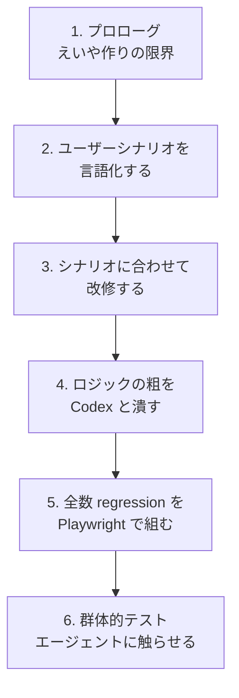

## はじめに

社内向けの評価制度システムを、Claude Code に投げて「えいや」で作りました。

数日でとりあえず動くものはできたんですが、**実運用に乗せようとすると突然なにも信用できなくなる**。画面は出る、ボタンは押せる、でも「このスコア計算、本当に合ってる？」「このフェーズで本当にここまで操作可能でいいんだっけ？」が分からない。仕様メモは Excel に書いてあるけど、コードがその通り動いている保証はどこにもない。

そこから、エンジニア一人で「実運用に耐える品質」までどう持ち上げたか、Claude Code + Codex (CLI) と二人三脚で進めた試行錯誤を連載で書きます。

特殊な技術はほぼ使っていません。やってるのは **当たり前の品質保証プロセス** を、人間 1 人 + AI 2 体でどう回したか。同じ規模の個人プロダクトを抱えてる方の参考になれば嬉しいです。

## このシリーズで扱う流れ

連載の全体像はこんな順番です。



| 話数 | テーマ | 状態 |
|---|---|---|
| 1 | プロローグ — えいや作りの限界とこれから | 本記事 |
| 2 | ユーザーシナリオを言語化する | 予定 |
| 3 | シナリオに合わせて改修する | 予定 |
| 4 | ロジックの粗を Codex と潰す | 予定 |
| 5 | 全数 regression を Playwright で組む | 予定 |
| 6 | 群体的テスト — エージェントに自由に触らせる | 予定（現在進行中） |

## プロダクトの中身

評価制度を回す Web アプリです。コンサルティング会社向けで、想定 100 人規模。

- メンバーが目標を立てて、上長が承認
- プロジェクト評価・社内貢献評価を入力
- 部門長が部下の評価を見て調整
- ラウンドテーブルで全社横断調整
- 最終評価をフィードバック

5 つのフェーズを順に回しながら、ロールが切り替わって入力者が変わっていきます。

技術スタックは普通の組み合わせ:

- Next.js 15 (App Router)
- Supabase (Auth + Postgres + RLS)
- Vercel
- Playwright (E2E テスト)

## 「えいや」で作ったあとに見えてきた現実

最初は順調でした。Claude Code に「Excel に書いてあるこの評価制度を Web 化して」と投げて、3〜4 日で UI が立ち上がる。ログイン・目標入力・評価入力までは普通に動く。

問題は、**ある程度動いてから** でした。

### 1. 仕様と実装のズレが分からない

評価制度の元仕様は Excel に書かれていて、ウェイトや配分が複雑です。

```
プロジェクトデリバリー: SM 55% / M 70% / SC 80% / C/A 80%
品質スコア: 論点設定 / 課題解決 / オペレーション / コミュニケーション / マネジメント
規模スコア: 売上ベースで 0 / 3 / 5 / 7 点
```

実装はあるけど、**Excel の通り計算してる保証がない**。手計算と突き合わせて検算しないと信用できない。

### 2. フェーズ間の遷移が曖昧

「目標承認前なのに自己評価フォームが見える」「差し戻したのにステータスが更新されない」みたいなバグが、画面を巡回するたびに見つかる。

操作シーケンスごとの「あるべき UI 状態」を一覧化していないので、レビュー側も何を確認すべきか定まらない。

### 3. 1 人テスターの限界

ロールが 5 種類（owner / dept_head / manager / evaluatee / admin）、フェーズが 5 段階。組み合わせのテストを自分 1 人で人力でやろうとすると、ログアウト → 別アカウントログイン → 該当画面までクリック → 戻る、を延々繰り返す。

**手動だと現実的に網羅できない**。

## やったこと（次話以降の予告）

上記の問題に対して、順番にこういう手を打ちました:

1. **ユーザーシナリオを仕様から書き起こす**（第 2 話）
   - 「F1: 目標設定フェーズ」「U6: PJ 一次評価入力」みたいに、確認すべきフローを言語化
   - これがないとテスト設計に入れないし、Codex に投げる仕様も書けない

2. **シナリオに合わせてプロダクトを改修**（第 3 話）
   - 言語化してみると、画面の足りない要素や、表示制御の漏れが見えてくる
   - シナリオが通るようにつくり込む

3. **ロジックの粗を Codex と潰す**（第 4 話）
   - 評価スコアの計算式、状態遷移、認可制御を Codex に並列で見てもらう
   - 自分一人だと見落とすエッジケースを拾う

4. **全数 regression を Playwright で組む**（第 5 話）
   - シナリオを E2E テストに落とす
   - リリース前に 1 コマンドで全網羅できる状態にする

5. **群体的テスト — エージェントに触らせる**（第 6 話、進行中）
   - 1 人テスターの限界を、複数エージェントを 1 人ずつのロールで動かして突破する
   - 「えいや作り」とは別の意味で、AI による品質保証の試行錯誤

## 次回

次は **「ユーザーシナリオを言語化する」** からスタートします。仕様書を Codex と一緒に読みながら、確認すべきフローを順番に書き出していった話です。

---

:::message
この連載は実際に動かしながら書いているので、進行中の話（第 6 話）はまだ結論が出ていません。途中経過込みで残します。
:::
