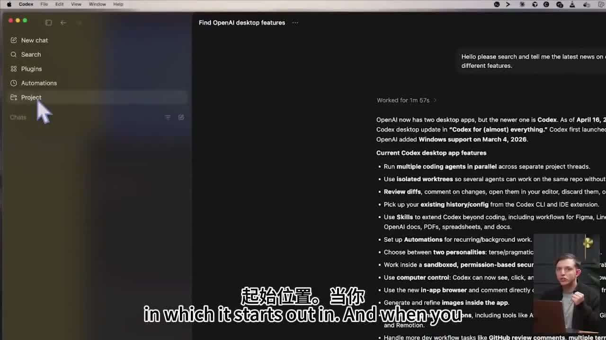
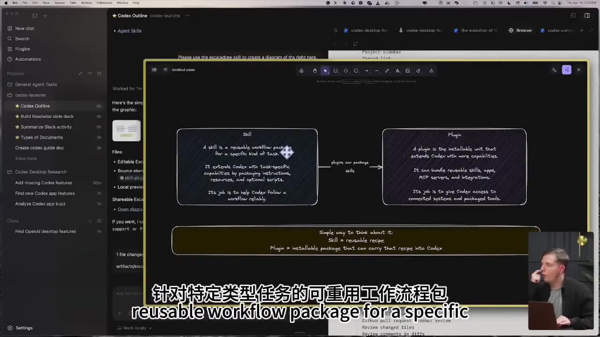
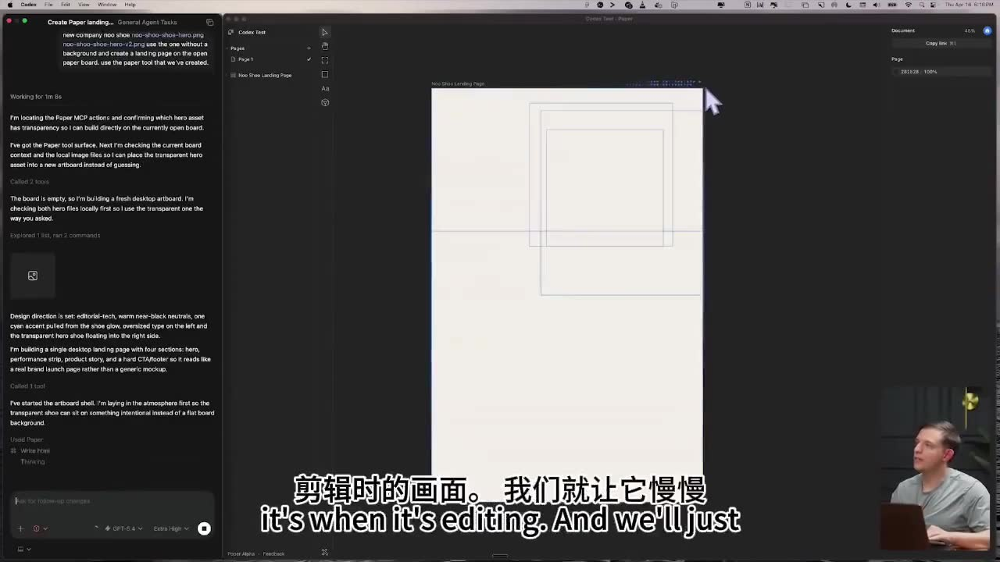
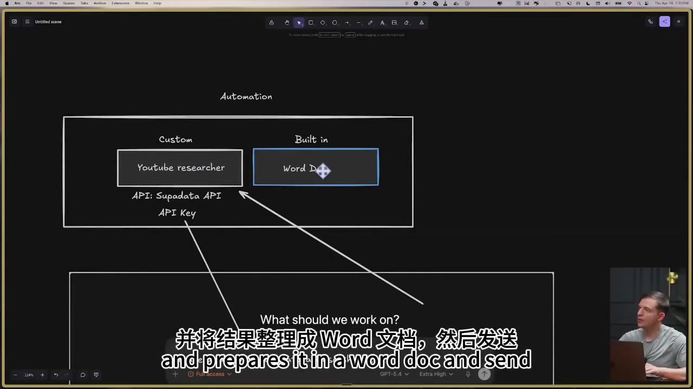

## はじめに

OpenAI Codex のデスクトップアプリは、コーディング支援にとどまらず、デザイン・ドキュメント作成・調査・自動化まで幅広く対応できる AI エージェントプラットフォームです。この記事では約 103 分の完全ガイド動画の内容を日本語でまとめます。

---

## Codex デスクトップアプリの主要機能

動画冒頭で紹介されていた機能一覧がこちらです。



- **複数コーディングエージェントの並列実行** — 別々のプロジェクトスレッドで複数エージェントを同時稼働
- **Isolated Worktrees** — 同じリポジトリ上で複数エージェントが競合なく作業可能
- **Diff レビュー** — 変更内容のコメント・編集・破棄をエディタから直接操作
- **既存の履歴・設定の引き継ぎ** — Codex CLI や IDE 拡張の設定をそのまま利用
- **Skills（スキル）** — コーディング以外のワークフロー（Figma・Linear・PDF など）に拡張
- **Automations（自動化）** — 定期・バックグラウンド処理のセットアップ
- **Computer Control** — 画面の視覚認識・クリック・操作が可能
- **インアプリ画像生成** — アプリ内でそのまま画像を生成・精製
- **インブラウザコメント** — 実装されたページに直接コメント可能
- **GitHub PR レビュー・Jira 連携** などの開発ワークフロータスク

---

## Skills（スキル）と Plugins（プラグイン）の違い

動画中盤では Excalidraw スキルを使って構造図が自動生成されました。



| | Skill（スキル） | Plugin（プラグイン） |
|---|---|---|
| **定義** | 特定タスク向けの再利用可能なワークフローパッケージ | Codex に追加機能をインストールする単位 |
| **役割** | 指示・リソース・スクリプトをまとめて Codex のタスク処理能力を拡張 | スキル・アプリ・MCP Server・統合機能をバンドル |
| **目的** | ワークフローを Codex に確実に実行させるレシピ | 接続システムとパッケージツールへのアクセスを提供 |

:::message
**シンプルな覚え方:**
- Skill = 再利用可能なレシピ
- Plugin = そのレシピを Codex に持ち込めるインストール可能パッケージ
:::

---

## デザインツール連携（Paper / Figma 統合）



Codex は Figma ライクなデザインツール **Paper（Alpha 版）** と統合できます。

**デモの流れ:**
1. 「新会社 Noo Shoo のロゴ画像を使って、Paper 上に直接ランディングページを作って」と指示
2. Codex が Paper MCP アクションを確認し、ヒーロー画像の透過素材を選択
3. デザイン方針を自動決定: editorial-tech・ウォームニアブラックニュートラル・シアンアクセント
4. 4 セクション構成（Hero・パフォーマンスストリップ・プロダクトストーリー・CTA/フッター）で自動構築

:::message
Paper は AI エージェントとの連携を前提に設計されたデザインツールで、Figma の直接編集より直感的な操作が可能です。
:::

---

## Automations（自動化）機能



### 2 種類の Automation

**カスタム Automation**
- 例: **YouTube Researcher**（Supadata API を使用）
  - YouTube 動画のトランスクリプトを取得（月 100 件まで無料）
  - 調査結果を自動で Word 文書にまとめて出力
- 外部 API キーを設定することで任意のサービスと連携

**ビルトイン Automation**
- Word Doc など標準で用意されているもの
- 追加設定なしで利用可能

### 実践的なユースケース

```
「先週の競合リサーチをまとめて Word にして」
→ Supadata で YouTube を調査 → 結果を Word 文書に自動出力
```

---

## マルチエージェント並列処理のデモ

動画では以下のタスクを並列実行する様子がデモされました:

- **Codex Outline** — アウトライン作成
- **Build Readwise slide deck** — スライドデッキ作成
- **Summarize Slack activity** — Slack の活動サマリ
- **Types of Documents** — ドキュメント種別の整理
- **Create codex guide doc** — ガイドドキュメント作成

各スレッドが独立して同時進行し、作業効率を大幅に向上させています。

---

## まとめ

Codex デスクトップアプリは **コーディングだけでなく、デザイン・ドキュメント・調査・自動化** まで対応できる総合 AI エージェントプラットフォームです。

- **Skills + Plugins** の組み合わせでどんなワークフローも自動化できる
- **Automations** により定期的なリサーチ・レポート作成を完全自動化
- **デザインツール連携** で非エンジニアの業務にも活用可能
- **YouTube トランスクリプト API（Supadata）** を活用したコンテンツ調査フローが特に実用的

タスクの規模や精度要件に合わせてモデルや処理負荷を選択できる点も Codex の強みです。

---

## 📝 全文書き起こし（原文英語）

> 5分ごとのチャンクで文字起こしを行っています。


**[0:00]**

Welcome to the OpenAI Codex Complete Guide, where we will be learning how to use OpenAI's new Super App to create and edit designs, do research and create documents, create and deploy full web apps, create motion graphic launch videos, create high quality investor decks that you can export to Canva, and even create high quality iOS apps in Swift. What you'll realize in this video is Codex is the only unified, all-purpose AI agent tool. One that combines coding, co-work, browser, and computer use cases all into one single interface that we are going to cover in great detail. So this video is going to be divided into two parts. We're going to first start with the basics, and then we are going to move on to multi-tasking and creating many different things in parallel. Part one, we're going to talk about the basics of prompting. We're going to talk about permissions, the different AI models you can use and the effort. We're also going to talk about the main features in the app. We're going to do a detailed dive into all of the different things that you can do on Codex. We're going to talk about how to stay organized. We're going to talk about this preview, which makes Codex so useful for basically any use case. You can even comment directly on the preview to give additional information to the AI agent. We're also going to talk about how to create PowerPoints, how to create Excel sheets, and how to create documents. We're going to talk about skills and plugins. We're also going to create automations. So you can simply chat with Codex to create automations that allow you to just save so much time. And then we're also going to talk about computer use, which allows your agent to literally control your computer. And the OpenAI computer use is best in the world by far. And so part one is going to feel very linear and somewhat slow, but we're really going to dig into the basics. And part two, we're going to start to have a lot more fun. In part two, we are going to create a design for a mobile app. We're going to create a mobile app. We're going to build a web app. We're going to build an investor deck. And we're going to create a launch video. And we're going to do these all at the same time. And so we are going to dive into multi-tasking with Codex. Because every month that goes by, AI agents are working for longer and longer. To the point where AI agents can take up to an hour or two hours on any given task. So in order to become effective at using AI, you need to learn how to multi-task. And in this part, I want to talk about how I'm multi-task with Codex. And so by the end of this video, you're going to be ahead of 99% of people in terms of practically using AI agents to dive into this. And I'm going to do this with AI agents to get work done, whether it's coding or general use cases and creating documents and things for work. Let's dive into the video. Okay, so let's first start off by downloading the Codex app. So you can go to any browser and type in Codex app download. And here we see chatGPT.com Codex desktop app. We're going to click on this. The page should look like this. And here is where you can download this for Mac OS. I already have it downloaded, but just click this and go through the process of getting it on your computer. Okay, so when you download the Codex app for the first time, it'll look a lot like this. You're going to see this left side panel with these five options over here, which we're going to dive deep into later. You're not going to see any conversations over here. And then you're going to see this kind of chat interface that looks oddly similar to chatGPT. And we can actually open up our CareRealQuick. Here is chatGPT. This is what chatGPT looks like. It's very similar. You type a chat and you get a response from chatGPT. It's very similar. So it looks similar from this perspective, but there's so much more in this application. It is unbelievable. So if I were to type something here, let's say I type something like this. Hello, please search and tell me the latest news on OpenAI's new desktop app. List all the different features. Just like chatGPT, it has built-in web search, so it'll automatically search the web. And it will give me a nice response. I can also type that into Codex and press Enter. Now, notice here that the chat find OpenAI desktop features showed up here in the side panel under this chat's column. This is actually brand new to Codex. They added this chat's column. This is because we didn't actually select which location we wanted this chat to be in. And I'll explain that right now. What makes Cloud Code and Codex so powerful is that it is an AI agent that can basically control your entire computer. It can create files, it can edit files, and as we'll get to later, it can even use computer use, which means fully controlling the mouse and keyboard on your computer. And so when you do this, the most useful way to do it is to give it a specific location in which it's a specific location.


**[5:00]**

starts out in and when you create a project it's going to open up your folders on your computer right it's going to open up finder and so I create a project called Codex projects and you can create anything you want you can call it Riley's Codex or you can just put them in your documents folder. It doesn't matter. I keep it organized and I'll all even create a new folder So I'll just say like Riley's Codex projects. So this is the folder that I'll create where I will put all of my other projects beneath it. So I just created this Riley's Codex projects. Now let's say I wanted to do some research on all the cool things about Codex and the new desktop app and I can create a project where all the documents that I create about this will be stored in that location And so what I'm going to do is I'm going to hit new folder and I'm going to call this Codex Desktop Research and we're going to hit create We're going to select this folder and we're going to hit open notice here that a project was created we have one project created and it's called Codex Desktop Research. Now if we click on this button we are now creating a new chat at Codex Desktop Research. It's also listed right here Codex Desktop Research. So when we create a chat it'll show up here. So I'm just going to say please tell me about the new Codex Desktop app features that they released today and again this can search the internet by default. It can go off and do research and notice here if we were to expand this this chat shows up right here and it will automatically use a eye to name it. So find new Codex app features. Now we can press this button again and we can actually create a new chat. I can say what are people saying about the new Codex app figure out a way to look at blogs and x.com and what are people saying what are they excited about. So these are chats under the same project and they work at the same time and you can tell that it's in progress because of this right here right you can see that we have this spinny circle right here so we know that we're waiting and one of the coolest features of the Codex app and other similar apps like it is it makes it pretty easy to multitask and so we'll know when it's done because they blew little dot there we go right on cue. So this blue dot popped up here. Now we know that we have like an unread message so we can click on this and so here we can find the new feature and let's say I don't want to read it like this. I can say please create a spreadsheet of the new features that you just told me. And so now what it's going to do is it is going to create a spreadsheet which is a document and it's actually going to store this spreadsheet in this folder right here and remember you can always get back to this folder for this project by clicking these three dots and hit open in finder and you can see that it opens up right here and we can click into it and we're going to be able to see all of the files that get created. No files have been created so far and these chats don't actually get stored here. It's just the files that they create. Oh and here we go it just created this outputs folder we click in this and so it's created the folder. It hasn't yet created the document yet and if you'll notice here it's done and you'll see at the bottom we have this codex desktop features.xlsx if we go ahead and we just click open look at this it opens right here in the side view. Notice here if we don't want this side by side view we can come up and we can press this button right here which will allow us to full screen it and I could even remove this side panel and now we're operating in this spreadsheet view and it is literally full screen. Yeah I can view the whole thing and I can create a follow up and I could say something like please remove the source page column and so now we can just see that it is working and you can tell it's working because it says stop and we can leave this full screen view and we can see that this was entered in the chat. So this is a fun way to toggle between like here you can see all of your agents in the chat and what your agent is working on and if you want to just focus on the thing that you're working on again you can full screen this and you can remove the side panel to kind of toggle between the views. And look here it's done you will notice here that the source column is no longer here it removed it and so we can just use AI to edit this document pretty perfectly and remember remember when I said that all of the files that your agent creates will show up in this folder and you can open in finder at this location and we can open this and here we can see that this XLS this is the file that we're working on right now.


**[10:00]**

So all of it is stored in this file. And so this makes it easy for me to create chats and reference that file. I can very easily hit create new chat and I can say, please add anything that I missed to at and we should be able to see the file. If we go back to finder we can see that this file is called Codex Desktop Features. And so we can go at Codex Desktop Features. And so we can at mention that file and say do research, let me know if I miss anything for new features for Codex. And so within this chat, like within this folder we can at mention anything that we create, which is really, really fun. Okay, I wanted to take a brief moment to just recap everything that we've talked about before we dive into more advanced topics. Codex in its simplest form, this Codex application allows you to chat with an AI agent that can create edit and delete files on your computer. And the specific parts of the app that we've talked about, the project location or file path, is right here. The permissions are right here. It's basically what your agent is allowed to do and do you need to approve its actions? I prefer using full access. So just let it cook. And then we also have the model, GBT 5.4 and the effort level, which is extra high that I use by default. And you can type your question or answer or whatever you want to create, you can type it in. When you type it in, when you choose a file location, it'll also show up in the side panel right here. And again, your project location, Codex Desktop Research, Codex Desktop Research, this chat, whatever you type in, will be named and will be placed here in the side panel. And if we go down here, your agent can also create files. Right? So it can create this dot xlsx document on your computer. And so this is just an agent created file. And this agent created file gets added to this folder that you created. Right? The same project location, your file created by an agent. If the chat is within this project location, that file will actually show up in this Outputs folder within the Codex Desktop Research. So you can see they all get organized in this clean file layout. And then if you press this open button right here, then it opens up the file in this clean view. And remember, you can full screen this view if you want to. And you can see all of your files here. So you can actually have multiple files open, which will get to a lot later. We haven't done this yet, but you can see the file name right here. And so that's kind of a basic overview of what we've talked about so far. Now let's dig into some more fun workflows and more fun projects. So now I want to go over the other options up here on the top left. The first one being search. And don't worry, we'll get to plugins in a second. This is when it gets really fun. But you know how we have two projects over here. I've actually created over 30 different projects in the time that I've been using Codex. But one thing that you can do is you can very easily remove them from the side panel. That doesn't mean you delete anything. Because remember, these are all just folders on your computer. And those don't actually get deleted. You just remove them from the side panel. But this search feature, what I can do is I can search anything. So I remember I looked for, I said to do research and create a report in the style of carpothy. But I removed the project. But if I just type in carpothy, it can actually, it searches all the chats for the name carpothy. And I can click on it. And now this chat opens up. And you can see here that the name of the chat is analyzed carpothy voice. And it's in this general agent task. So remember, this is just the project folder. So this Codex desktop research, right? That is the project folder. This is a general agent task folder that I removed from the side panel. But if I click on this, it'll actually open up the location. And then all I need to do is just drag this in here and boom. Now all of the chats for this general agent tasks here shows up here on the left side panel. Right? That's pretty cool. And again, I can remove it and I can bring it back whenever I want. And so in order to access this search menu, you can just press command G and we can just type in Codex outline and you can open it without even clicking on it, which is kind of fun. Here is application that I was working on earlier that goes through all the features. But we're going to get to more advanced applications in just a second. First, I want to talk about login. And so yeah, many people get these confused plugins versus skills. And I will say the line between plugins and skills is a little blurry. And so I actually just ask Codex to create a little graphic using my Excaladraw skill that I created. And I had it create this image. And then I exported it and here it is. So fun fact, I generated this with my Excaladraw skill. But let's talk about the difference between skills and plugin. So skills are basically a reusable work plugin.


**[15:00]**

Oh, package for a specific kind of task. And so you can think of a skill as a reusable recipe, whereas a plugin is the installable unit that extends codecs with more capabilities. And so you could see here, if we click on plugins, it's kind of weird, right? In the Cloud app, we can see that they call it the customized tab. And then here they have skills and connectors. Open ally has plugins and skills. If you use different tools, they have different vocabulary for each one. So I kind of just clump these together, and I personally think of them as skills. And so skills are just ways to extend the capability of the model. Right? So if I wanted to say something to codecs and be like, hey, check my email and tell me all of the urgent messages that they've sent me today. Right? It could do that right as you download it codecs. You need to give it the skill of email. And so I've done that already, right? I've given it the email skill. One thing that I can give it is my Google Calendar skill. I haven't done that yet in codecs. So let me show you this. So this is actually a plugin. Sorry, Google Calendar plugin. And so I can give it the plugin, and so we can hit install, Google Calendar. And this will automatically take me to my browser where I can sign into my email, and I can hit continue, and we can hit select all continue. And now, once we get the verification, Google Calendar is ready, Google Calendar is now connected. That means the calendar is now plugged in. Now, if I go, let's say we go to, let's go to general agent tasks because that's what I want to do right now. And we're just gonna press this button right here. Now, we can say, please list out the events for this week for me. And I can press slash, you actually wouldn't have to do this. You don't have to type in everything. The agent is smart enough to just do it. And you'll see here that Google Calendar shows up right here. And so I can say, please list out the events for me. List them out here in the chat, and we can run this. And look at this. So all of my events are listed out right here. So this is my entire calendar, listed out right here. And so I'm gonna say, please can you send me a weekly recap in email? Just email it to myself, because I've set up my Gmail integration, and I can hit slash Gmail. And please send me this recap to my email. And so that's all we're doing is we are sending this to my email. So it's using the Gmail skill, connected Gmail address, and it's going to send me the email. I found the email address is my email right here. Sending the recap there with the week and conflict note included. And so it's done. So I sent the recap to your email with the subject, weekly calendar recap. If I go to my email application, I can see here, check this out. Here's the email that I got, and I use superhuman for email. And here it says weekly, it's been sent from me, and here's this weekly recap. Now one thing that we're gonna talk about, and I'll talk about more about this later, is automations. I can just say, please can you make this task and automation for every Friday at 4pm for the previous week? Okay, look, I'm turning this into a weekly automation blah, blah, blah, blah, blah, blah. Here it says, created weekly calendar recap Friday's at 4pm. And so if I click on this right here, I can see this weekly calendar recap. We can see that the status is active. The next run is tomorrow at 4pm, right now it's currently Thursday at 4pm. And it's never run before, so it doesn't list the last run, and that's what we got. And what you'll notice here, if we actually go up to automations, we now see a one by automations. We can click on this, and here we see the automations. Look at this, and you can actually test this automation just by hitting play, which will automatically play it, or we can edit the automation, and it is very easy to just edit it, and we can add to it, and I can say, make sure to use the Gmail skill, if you want to, you actually don't need to do that. It's basically implied, and it's that easy to create in automation, you just ask codecs to create an automation. And so if you're ever confused about what a plugin can do, just create a new chat. So what we're gonna do is we're gonna do a general agent task, we're gonna create a new chat, and I'm just gonna type in that, and this is a plugin, and I'm gonna say, please tell me what actions I can do with this plugin. I've never used it, describe to me what I can do, or what you can do, your abilities with this plugin, list all. So now, Figma, we will learn about the Figma plugin. And here it listed all of the things that it can do. A very quick side note, you'll see this carrot here after working for 18 seconds. You can actually click this, and this will show,


**[20:00]**

Kind of it's thinking behind the scenes. Figma plugins gives me three broad kinds of abilities. It can expect existing Figma files. It can generate new visual artifacts and connect Figma to your code base. And so we can just test this out right now. So I have Figma open right here. And I guess I'm just going to create a new design. And let's go ahead and call this. Because I don't see the ability for it to create a new design. So I'm going to rename this. And I'm just going to say, I created this new Figma board called Riley New Design. Can you please put Hello World on that design to see if that works. So now we're going to test out this Figma integration. And so look at this. And says Figma is running locally. I'm switching to the text tool and placing a simple Hello World on the canvas. And so now it says Hello World is now on the Riley New Design canvas. Let's go ahead and go over there and look at this. We have Hello World. And I've been typing a lot in this video. And so I'm going to show you how I normally interact with AI agents, which is just with my voice using a tool called Whisper Flow. And that's literally you can look it up on Google. You can download it. They have a generous free plan. But all you have to do is hold the FN key. And I can speak my idea. So now I want you to go to Figma actually. I don't want you to ignore the Hello World. That was just to test. Now that I know that it works, I want you to make a mockup design on Figma for my new shoe company called NU-Shoo. N-O-O-S-H-O-O. This is a new futuristic shoe. And I want you to create a landing page for it. So do that on Figma. If you need to get an image of this new shoe, generate it using your built-in image generation tool. And take a look at this. It just generated new shoe. And it generated an image right here in the chat as you can see here. And now it says Look at Codex. So it's actually seeing the computer use is actually checking to see if it generated it. So now I'm using Figma, Figma's slash-generate design for Figma landing page workflow, and image-gen for the product art. And so it generated this without a background. Notice here if I were to copy this image and I were to open it up, you can see here it's saved to my clipboard without a background. And that's a pretty cool shoe. So I'm not going to lie this Figma integration is pretty much made for you to have a Figma board. And convert the Figma board into code rather than like telling it to generate code and then put it on to Figma. And so there's actually a tool made specifically for that, which is called paper, which a lot of talk to a lot of designers and a lot of designers are switching to this. But what this allows you to do is you can create a new file here. And I'm just going to call this a Codex test. And what I'm going to do is I'm just going to press new. I can say slash paper. And I have this skill that I've created previously called paper desk deck style. But what we can do is we can actually go to plugins and we can hit manage. And here we have MCPs. And here we have this paper MCP. And so if you are ever using a tool on their website, they might say like use the new paper MCP or use the new Figma MCP or use the new notion MCP. You can literally just go to Cloud Code, this works in Cloud Code or Codex and say, hey, I want to be able to use this MCP. Can you please create a skill that wraps this MCP? And that'll tell it that it can create a skill with that MCP so that you can use it really easily. So what I'm going to do is I can go to this new chat here. And I can hit slash paper or I can say use the paper MCP to create a landing page for my new company, new shoe. And remember, we've created those files for new shoes. Let's see if they're in here. Yep, new shoe hero. And we can type at new shoe PNG. Use the one without a background and create a landing page on the open paper board. Use the paper tool that we've created. And since I've already created this, you're going to see in my opinion, this isn't the best way to get AI to make designs for you. Check this out. So we can open up paper. Oh, this is really cool as well. So if we open up this general tasks here and we right click on this chat and we say open in mini window, we can actually open this chat in a mini window and we can minimize code X. So now we can have whatever application we want to have open here on the side. And here it says, OK, the board is empty. So I'm going to build a fresh desktop art board. I'm checking both the hero files locally. OK, design is set. I'm building this. Look at this. So it'll just generate a landing page design. And we can just have this open. We have the chat open on the side. And I love this animation when.


**[25:00]**

It's when it's editing and we'll just let it cook. Okay, you see here it created this top board or top bar technology performance launch. You can see, oh, move like the roads has been written. New shoe blends featherweight, knit, all right. So these buttons are a little overlapping. Remember the AI might fix this. It might just realize that messes up and it'll actually just fix this. Oh, this is a great opportunity to talk about a new feature. So one thing that a lot of AI tools have is message queuing, which basically, like, if I were to type a prompt while it's working right now and say, like, please fix it on a lot of AI tools, what it'll do is it'll wait for the AI to be done before entering the prompt. But codex has steering built in, like, like, your steering wheel and what you can do is as I can paste that screenshot and just say, oh, by the way, there's some overlap here. You might want to fix this while you're working. And so when you press enter, by default, it'll be queued up. But if you click steer, it'll actually enter it while it's working. So you don't even have to wait for it to be done. You can kind of steer it while you work. And so you can see here, once it's done with its latest activity or tool call, your prompt gets entered. And so now in the middle of your conversation, it says that I saw the overlap. I'd already started moving the CTA in stats down, but I'm rechecking the hero and adjusting the copy, and it'll hopefully make the fix on this specific run. And look at this. So it's already starting to fix it. And here we go. And I could say something like create four more variations. I want you to make slight modifications on each. I'm not going to go through this whole process, but the point I'm trying to make here is paper is a software tool that was designed specifically to connect to your AI agents, like codecs, like cloud code, and there will be way more tools just like this. I think there's a massive opportunity to create tools that connect to other agents that people already use. And you can see here, Figma has a really bad integration in my opinion, compared to paper. Paper is just way more fun. And look at this. It just created this new variation. And it is going to copy over everything. And that's how easy it is. You just get AI to create multiple variations. Look at this. Number two, number three, and number four. Right? Making them with different background colors. It's working on them in parallel. And this tool, paper, was made specifically to be an integration into your existing tools. And this is going to be a massive trend going forward. And so plugins are kind of pre-made for you. A lot of the time. They're just built into codecs. And this list is going to get a thousand times bigger. This tool is going to become so popular that every software platform in the world is going to be begging OpenAI to create an official plugin for them. So you show up at the top of the list. The value of showing up at the top of this list for like GitHub, linear, all of these tools, even showing up at this part right here, like neon postgres, like this is so valuable to show up here on this list. And so there's going to be more and more of these integrations. But it's important to realize how to create your own skill. So let's go ahead and create our own skill. So if we go to our general agent tasks, we open up a new task. One of the things that I was constantly doing over and over again was going to YouTube. And I would go to this site called like YouTube transcript, extractor. And I wanted to wait very easily, like pull a transcript from a video. And then I wanted to be able to do it for all of the videos of a given channel. Or, or I wanted to be able to search YouTube and pull the transcripts from a certain search term. And so I looked it up. I said, hey, I want to be able to use an API. And so an API for those of you who are untechnical, you can think of this as just like a way to use code to access certain information from other people's software. And so when you're vibe coding, a lot of you guys who follow me have vibe coded before. And if you wanted to add an AI chat to an application, you needed the OpenAI API, which you also needed an OpenAI API key. And this would basically grant you access to add the OpenAI technology into your app. And so this is what I'll do all the time. Like in fact, if I'm running into an annoying process that I'm doing over and over again, I'll just look up and see if there's an API for it. So it's like I want to be able to use an API to pull YouTube transcripts. Can you suggest the top five for me? And look at this, it just created a list of different ones that we can use. Here are the top five, Super Data, Transcript API, YouTube Transcript.io, and great creators. So I'm going to go ahead and I'm going to check out Super Data. And I have used this before. What we can do is we can sign in. And once you sign in and putting your credit card, you can get an API key. I think I might even be on the free plan.


**[30:00]**

a certain amount of transcripts per month. I think you get a hundred free per month. So I'm not on my personal super data account. I don't think I'm using that many of them. So I can copy this API key and we can go back to codex and say, okay, please can you create a skill that allows me to ask you to summarize the latest 10 videos from a certain YouTube channel. And you can always use this API to just immediately pull them. So you can go to their YouTube channel. You can search our YouTube channel. Get their latest five videos and pull the transcripts and then summarize them. I want you to create a skill. So you're going to need to look and research how to use super data and figure out how to use it well and quickly and create a skills so that I can always ask you for this information. Here is my API key. I'm going to include my API key. I'm going to paste it at the end. I don't want to show it on camera. But one thing before I want to do that is you can type in skill creator. And this will indicate that it should use the skill creator. It'll help it understand what it needs to do and this skill makes it really good at creating skills. And so here is the key. I'm going to paste it, but I'm going to do it off camera. Okay, so I entered my prompt. It's now running. I'm just have this covering up my key and it's going to use the skill creator and it is going to create the skill. And then once your codex is done working and it's created the skill. Again, you go to plugins, you click on skills and you'll see it right. Right here. And so it created the skill called YouTube researcher. And so in order to use a skill, you actually need to create a new session. So this is the session that we created the skill in. Once we're done, right, we can just hit this new chat button and we can just type in YouTube researcher. And so please can you look at Riley Brown, latest 10 YouTube videos, pull the transcripts and summarize them in a document. And please, I want you to inform me which of these videos did well and which of these videos did not do as well. And this should be kind of an analysis of what people are interested in. That's what I want you to look in. And then also do a hook analysis. So based on like the intro of my video, I want you to say which intro did well, which intros did not do well. And in this report, I want the YouTube thumbnails in there as well. So super data can also pull the YouTube thumbnail, which is really cool. Okay, so it is done. And you can see here, we see this report. If I click open, we now have this Riley Brown YouTube report. And look at this. So this is using this skill right here, which is the slash docs, Word docs, skill. This is, I think this comes built into Codex. And it looked at the full transcripts. And here at the bottom, we see the hook winner. So Claude is taking over big market shift high urgency. These intros did best. Claude code leak. Open Claude Blender skills. Claude code can design now. Why specialized agents are superior. That's pretty good. The hooks that didn't do well is build a sync web app in mobile app in 16 minutes. That video did not do as well. The 35 fundamentals you need to five code your first app. So it looks like vibe coding did not do as well. Building a mobile app with open AI codex and seven open class skills that can connect your output. Very interesting. So it even told me what to double down on. So this is pretty cool. So it took all of that YouTube data and turned it into a document. I'm going to say, okay, on the last day of every month, I want you to do this for the videos for that month. Can you create this automation that uses the slash YouTube researcher skill and the slash word doc to create a report just like this for the videos for that month. Make it slightly more brief and in the table make them ordered by view count. And so now we're running this. We can exit full screen mode and that's exactly what we're going to do here. So what we did here is we basically created a YouTube researcher skill and this required an external API and we just did research on codex to find the super data API. And then what we did is we got an API key. We gave this API key two codex and we said create a skill with these super data API use this key and then this created this skill. So this process created this skill and then we said to use it. I said use the super data API to look up my YouTube, pull all my latest transcripts and then create a doc, right? And so we created a doc and then we kind of paired these together, right? We used these in tandem with one another. We used this and we created this automation, right? So we created an automation. We said every single end of the month at the end of every single month, I want you to create a report that searches YouTube and prepare.


**[35:00]**

So it's in a word doc and send it to me. And that's exactly what we did. And so if we go back to codex, let's see if it's done. Yes, it's done. And you see here it says created monthly YouTube report. So I can click on this and here, okay, I didn't realize this. You can reference skills in the monthly report. So that's useful to know. And you'll notice here in the automation tab, we now have a two. So we have two automations that are set up a monthly YouTube report and a weekly calendar recap. Okay, so we've covered a lot here in part one. We've talked about a lot of the basics, how the app works, how to create skills. We talked about plugins, automations. We've created a couple and we're kind of moving slowly through this process. In part two, we're going to be doing a role play and we're going to be creating six different things at once. And what I really want to show in this section is a how to do, like we're actually going to create a web app, we're going to create a mobile app. So we're going to learn about vibe coding in this process. But I also want to focus on multi tasking. As I said earlier in the video, these agents are taking longer and longer to complete tasks. So if you want to be efficient in this new AI world, you need to learn how to set, as like send instructions to an agent, trust the agent to do really good work, and then move to a new agent chat so that you can start working on something else. And all of the best engineers and the best operators who use AI are very effective multi taskers. And they're able to like just focus on one agent chat, put all of your effort into a prompt, and then once you press enter, to just check out of that task and move to a new one. So it's not even like multi tasking, you're like serial tasking. Each prompt that you type in is the task. And so we're going to create six different things in this role play. So in this role play, my name is Riley Brown, which is my actual name. But I want to create an iOS app. So my main priority is to create an iOS app, but creating the app isn't enough. Right? We actually have to do some marketing. And so that's why I'm going to be creating some exposed automations. We also need a high quality launch video. We're going to do a launch video. I want to raise a little bit of money. I want to raise a million bucks for this app. So we're going to create an investor debt. We're also going to release this launch video before this app is out. Right? So we want to go launch video. Then iOS app, which means that we need to create some sort of website or landing page that we can allow people to sign up for a wait list. You want to be able to collect data. And before we create our iOS app, we are going to create an iOS app design. And that's what we're going to do. So we're going to kind of move through these together. You know, we're not going to work on all six at once, but we're going to be working on many things at once the whole time. Until we create a system around this app that could be a fully operating business. And we're going to create some automations as well. So in order to get started, what I'm going to do is I'm going to go to Codex and we're going to create a new project. So this new project, we're going to go into Riley Brown. We're going to go into Codex projects. Actually, we're going to create a whole new folder here. And I'm just going to call this my new business. And what I'm going to do is I'm just going to open up this folder. And I'm going to hit new chat. I'm going to say I have a plan, create a Markdown file of my plan. Then what I'm going to do is I'm going to go to this little thing here. And I'm just going to take a screenshot this, put this image. I'm creating a mobile app right now. And a landing page as well as some other assets I want to create a design for this. I just want you to outline what I've put in this in a simple Markdown file. Whatever you see here, I'm also going to make a launch video with a remotion skill. I'm going to make what else am I doing, I want investor deck, I also want to make an investor deck. So please just make a simple, bulleted list that I can check off as I go along of all of these items. So there should be six each one of the ones that are listed here. And then please at the top put my app idea. So my app idea is as follows. And I put a little info here. The app is going to be called chorus. It's going to be a place where people can learn about AI agents. People can learn about the best agent platforms. People can learn about how agents work. Oops, we can stop it here. People can also learn about the best skills. So that it's going to be a skills library that I'm going to curate. That people can copy and paste into any agent and it will just work. So basically just put this in a very simple one-pager doc. Don't add anything. So we're kind of just creating a plan here in this my new business. Now, while that's going to run, what I'm going to do is I'm going to create a new chat. And I'm going to say I want to use the slash mobile design skill. Now, this mobile design skill is a custom skill that I made. And I actually extracted it from and thropex new design tool. So if you go to clod.ai slash design, they just released a new design tool that's like supposed to be like Figma and all I did. I had it create a mobile app design. As you can see here, there's this like design. And I want to be able to use a skill just like this. So then I just ask the agent.


**[40:00]**

I said, hey, can you tell me exactly how this design app worked? And it just literally worked for me. Like I just output it everything. So I just copied all of these documents here. And then I copied the files that this new claw design skill gives you. And then I gave it to Codex and I literally said the following here. I literally said this. I said, I want you to create a mobile design skill. This is how claw does it. I want you to mimic this. And then I just pasted literally everything it gave me here with all of the files. And it just created this mobile design skill. And it works really well. I'll show you. So we can go back to this. I want you to use a mobile design skill. And I want you to create the screens for this app in very basic Apple style design. We will add some flair in a little bit. I just want to get all the screens functionally correct. And so what I'm going to do here is I'm going to go ahead and run this. I'm going to go back to this chorus app plan. We can open this here in the side view. So you can see here we have this right here. So this app is going to be called chorus. So I can just copy this. And we can just paste this app idea. And now we're creating the mobile app design. And so what we need to do is we're going to create the design first. Then we're going to create an iPhone app. We're going to create a web app, investor deck, launch video, and X post automation. So we're working on this right now. And by the way, I will post the mobile app design skill on the actual app that we're creating. I'm going to put this on test flight. And I'll put it on a website somewhere below the video. So you'll be able to get this mobile app design skill. You'll be able to just copy the link and paste it into code X and use the skill for 100% for free. And okay. So while these screens are loading, we can actually get our mobile app set up. And so I'm going to go through this process relatively slowly so that you can understand how to build an iOS app with code X. So I'm going to say I want you to create a new project called chorus. This is going to be a swift mobile app. And what I want you to do right now is just make it say hello world. This is chorus in simple text in the middle. Basically what we're doing is we're just getting our project set up. We're not going to do anything else. Just put this text on a mobile app and open the X code project when you're done so that I can run it from X code. And so we're going to run this. In order to use this, you're going to need two things. And you can search on code X how to do this. You're going to need X code and I will pull it up here if you just type in download X code. This is Apple's developer platform and code X can actually connect to X code. And once you download this, you're also going to need to download iOS simulator if you want to run it on a little device on your phone. So that's those are the two things that I have downloaded and you're going to need the iOS simulator for this. And you can figure out how to download this. Just ask AI. You do need a Mac for this and you will probably need like 20 gigabytes of spare storage on your computer. So the chorus screens are still being built but the create chorus hello app is done. And so it actually opened up X code on my computer. Now what I'm going to do is I'm going to change this to one of the simulators. We're going to use an iPhone 17 and we're going to hit this play button. This should open a simulator. Here it is. And here is the app that we're going to be working on. So I'm going to move this right here. Here is going to be the mobile app that we are working on. And this is really cool. And as you can see here, hello this is chorus. This is the app. It is completely white. So this black text here in the middle. There's no app functionality. We just now have the project open. And now we can talk to codecs and we can actually edit this app. However we want we can build any features we want. Literally any features simply by five coding. And you'll see we'll add some more features later. Now here is an app where we see that the build chorus screens is done. We can click on this. Okay, so I actually just went to have lunch for about 25 minutes and we're back and all my agents are done. So obviously we have the Xcode project set up. And here we have the build chorus screens. So now that it's done and it gave us this prototype link. So my skill gives you a prototype link and take a look at that. So we have this app screen. It's very basic but we can switch screens here. We can switch tabs. So we have this like Learn tab and maybe you can do like agents 101. I think this is actually a decent start. I like the hierarchy. So like the Learn the different platforms. This is like a good. We can organize this or actually create real categories later. But this is ultimately what I want the app to look like and save. Is good. It separates the learning and the platforms and the skills. Here's you can see here we have multiple save. I like this design. So if we go to this chorus app and.


**[45:00]**

What we can do is we can say, please integrate. And you can actually go up here, what you can do is you can actually click on this toggle files. So here we have the output, oh, this is cool. Yeah, so now we can see we have this mobile design. So we can just say, please integrate the screens in the my new business folder in the mobile app and just make this app have all of these screens. We will populate it with real data later and build out the experience and polish the design. So implement it now. So we've created these screens right here. And this just gives us kind of a nice little outline. Oh, okay, okay, we can make some edits to this. But I think this is good enough to just implement. And so we can go to our plan and we could say, okay, mark the iPhone app as done and then make the building the iPhone app as working in the works and then also put web app and landing page in the works. Because now we need to create a landing page. Okay, so that just sent through. Now what we can do is we're gonna create a new chat and we're gonna say I want to create a very basic web app landing page that can collect data from interested users for our app. I just wanna create the shell and basically just have a page with a title that says chorus app. And then I want a field that users can fill out in order to put in their email and their information. Except we're gonna use an external tool for this. And so what I'm gonna do is I'm gonna go to art and what I'm gonna do is I'm gonna go to tally.so. So tally is a tool that I use to collect forms of missions. So here are all the forms of missions that I've created in the past. Here's a brand new form that we're gonna create. And so I'm just gonna say I'm gonna say wait list, chorus. And we're gonna use a template. Let's just use a template and we can just do this right here. And we can do last name first name email address. Yeah, let's use this template. And we'll keep this really basic. We'll just say sign up for chorus. We can always edit this later. But I think this is good. How do we, yeah, I think this is good. Let's how do we make this not, okay, there we go. Done, your registration is complete. We will reach out in a few days. Okay, that's good. So now what we're gonna do is we're gonna publish this registration template. Now we're gonna go to, I believe it is share. And we can do this standard embed right here. And so we can click embed the code link. And so we can copy this code. So you can see here it's saved to my clipboard. Or we can say get the code. Yeah, I think we can just copy all of this. And we can go back to code X. I am using tally.so. Can you please put this form in the site we will design it after, right? Because right now we are using tally to collect people's email addresses, right? So then we can reach out to them once we actually launch the app. So like right after this video in theory, I could put this up on the internet and I'll show you exactly how to do that. And we're creating just a website that embeds this code, which allows people to type that in, then we're gonna design out the rest of the website. And here we actually have this app is done. Well, and by the way for this tally app, I said make this a React app and run it locally. React is just like a good framework for design. I actually really don't even know what it is. I just know that every app I've created has been a React app. And here we can see that it's done. So if we click on this, it should open up the app here on the side. Let's see if this works. Okay, wait, while this finishes up, what we can do is we can go to Xcode. This does appear that it is done and we can run this again on the simulator and here it succeeded. And here we have the app running on Swift. Learn platform skills and saved. So this is indeed a Swift application and we have these pages, I wonder, do we want these fixed at the top? We will need to make some decisions here. Oh, okay, so this is running locally. This just opened up in my computer right here. We can see that this is working really well. And so I like this style. For whatever reason, CodeX likes to use this style by default, I'm gonna have it use a style that looks a lot more like this. We're gonna keep it very basic. And okay, so what I wanna do is I'm gonna go to this chorus mobile app, because here we're working on the chorus app. And again, you can rename these chats to keep them more organized. So in fact, I'm gonna show you. You can just right click and I'm just gonna say mobile app. We can rename this to web app. We can create chorus project plan. Yeah, we can rename this to plan. And we can even pin the plan to the top right now, build chorus screens. And so we can,


**[50:00]**

Name this screen design so that way we can stay fully organized while we work. Hi, I want to make some changes. So firstly, the name of each page, like for instance, learn, that should be pinned to the top and when I scroll, that should not scroll down. And so that should be pinned to the top. Right now when I scroll, the title of the app goes down with it, and it's just looks janky. And then as I scroll up, the tags at the top, those should scroll and every and as items go beneath the top bar, I want it to kind of fade out. And this should be consistent on every page. Right now when I scroll down on platforms, it'll just look a lot better. And then also the bottom little bar thing that has the four tabs. I really like the design. Keep it everything. Just move it down a little bit and then have as you scroll down, have the items fade out. So the list as I scroll down should not appear to be beneath the bottom bar. It should fade out as it gets like halfway through the bar. I've seen a lot of apps have this design or like right as it reaches the bar. It should have this light little fade out. Similar to how you're going to do the top as well. And yeah, we're going to run it. Okay, so once your mobile app agent is done, building every single time you actually need to hit play, and this actually rebuilds the app on the device. So now we want to test it. Let's see how this looks. We have this nice blur here at the bottom. We have a blur here at the top. Look at this. This is pretty cool. We can switch platforms. And we're going to replace this with all the different platforms up here. This is going to be pretty cool. This is looking really good, actually. I'm actually enjoying this. Research build here. We're going to be the skills for different appatars. Ooh, this is nice, actually. And then saved. We can save them. And that's pretty cool. These actually do get saved. This is very, very cool. Okay, so we're working on this app. It looks pretty good. We need to figure out a database. Right? We want to figure out how users are going to be able to sign in. Actually, we don't even need to worry about that. It's like, how do I update this with the right app icons, etc, etc. And ideally, how do I do it from here? So we can just ask codec. So I'm just going to ask it a long prompt here. What I want to be able to do is I want to be able to update the app, so that the different platforms and the platform types are kind of stored in a database. And I'm thinking, what is the easiest way to like store this information in this app, so that I can have you edit it with AI. Like I could just ask you right now to add it, things, or add things to this app. That's secure. So users won't be able to edit it. And like, what database should we use? And yeah, I want to be able to just like add it on of things to this, give you documents so you can add it so that it stays organic. So that it stays organized and over time it could scale up to like thousands of skills in theory in a couple years or something. And we're going to allow users to sign in. So what would be the best database system to set up so that you can use, like I could just ask you to add things to this app, and we could just create it basically with AI that would work with, with clerk, which is what we use from my company right now. And so this is just another thing to learn when using agents, right? If you don't know what to do, you can just ask it, right? It'll tell you the options, and you just need to say, okay, let's do it. Let's solve it. Let's try and figure this out. Okay. Well, that's working. Let's go ahead and, um, please generate 10 possible app icons for our app here. So I'm going to just screenshot it so it knows which app we're talking about, because it is located in the folder. We're working on the app now. I want 10 icons, no background, that fits this same style of this app. I'm going to delete something close to like these icons at the top row, generate 10 images all without a background. I want 10 options for app icons to choose from. These are iOS app icons. And as I said earlier, the codecs app actually has the built-in ability to use image generation. So it will actually decide what prompts to use, and it'll generate 10 images. Another thing that I want to do is I want to think about our launch video. And so if we go to plugins, and we type in the remotion, we see that there's this remotion plugin. This is how you can create motion graphics from prompts. We're going to use this. I've already installed it. Um, you see here it says remove from codecs. If you have an installed it, you'll see add to codecs. And then you can basically give it full access to do its thing. So if we come back here and we can say for the mobile app that we are working on right now that is the best place for people to learn about agents and download skills and save things and learn about agents and meeting become better and more productive and make more money with AI agents. I want to create a launch video. So please just come up with a list of considerations for this. Like what should we consider? Let's plan out the video where we are going to be using the remover. You can type slash. Actually, when it's in the plugin, you go at.


**[55:00]**

Be motion, skill. Don't make the video yet. I just want you to think about the skill and think about the considerations that I should consider when making this video. So now we can run that. Let's go back to the mobile app. Here is what it says. So as of April 17, the best fit for this would be clerk, super base postgres, why? Clerk already covers your off and clerk. OK, postgres is the right shape for this. OK, so we should use postgres. OK, so give me the link to get started. With super base. And is there a super base skill I could download that many people use? If so, download that skill, let's use it. Let me know where I need to sign in. So I noticed that in plugins, they didn't have a super base plugin. But super base are what most of the vibe coding platforms use for a database. In fact, lovable uses super base and super base is actually a more valuable company than lovable. It's like an incredibly valuable company. They're recently $10 billion and it's just AI's favorite database at this point. And so we're going to use it. And since it doesn't have a built-in plugin, I'm just having codecs search the internet and find a skill that we can use for super base. And while that is searching for that skill, we're going to go to this plan remotion launch video that's now done. And so based on the chorus plan dot MD and we have the Swift, the strongest launch video is as not the future. And it gave us this plan. It gave us some ideas, but I actually kind of want to make it more like the anthropic videos, which are doing a really good job of showing off the product. But the first thing that we want to do is just test and see if this remotion skill works. And remember, remotion is what we're using to create a motion graphics video. And so what I'm going to do is I'm just going to say, please use this skill to create a test video that just says, then it should show a mockup. It should flash between three more scenes that show these different screens. And so what I'm going to do is I'm just going to screenshot this screen and this screen and this screen right here just to give it some additional context so it knows what screens to use. I want you to make a mockup of these. So it looks exactly like an iPhone and have it animate on the screen. And just have these four scenes, the purpose of the and keep it as a white background. The purpose of this is to just really, I really want to just focus on seeing if this skill works properly. And please look into the skill to figure out how you can run this locally. So I can just click the local link and it opens up here in the side window. And I can see the video along with the different tracks and sequences. And if you get confused by that last part and I talk about tracks and sequences, I'll explain exactly what that means. I actually have a good deal of experience using the remotion skill. I used to use it in cloud code. I've used it in the vibe code app and it's a pretty easy skill to use. I'll show you. So here it gave me this link. We're back to creating a mobile app. Remember, I'm sorry if we're moving around, but remember, this will take like some of these will take like five or six minutes so we want to be able to multitask. So again, we're back. We're looking at how to use Superbase and remember, I actually don't use Superbase that often. So I'm learning this as I go. And that's part of what I'm trying to show you here is you can learn how to do things as you do it. It's part of the fun of using AI's. It will just tell you how to do things. You can just figure it out. So I'm just going to create a new project. New project name is going to be, and then we'll type a strong password, enable data, API and create new project. I'm going to say, okay, I created a new project. Send me the URL region and tell me when it exists. Okay, so we can hit save. I need to give it a URL region. It's loading up. That's pretty cool. And if you take a look here, if we click Connect, I noticed here that we have an MCP, we can choose Codex and we can give it feature groups only enable the subset of the features. All right, so we can just copy this prompt. So this should allow you to connect. If you can connect, create the full DB and add everything. If not, let me know what else you need. Okay, so the remotion launch video is done. So notice here, it gives us this local host, 3,031. We click on it, and a timeline opens up right here. And you can just edit this video. Take a look at this. You can just see a video. We have our app. This is a mockup of all the screens in our app showing up right here on our screen. And we're just using the remotion plugin. I didn't do anything crazy. You just enable the remotion plugin. You type at remotion and boom. You're using it. Now check this out. Please, can you? I'm just going to go on a tangent here and just kind of...


**[60:00]**

Talk about it and so by the way, this is how this works. So you have like each second, each second has 30 frames. So this is 30 frames per second and so you can always reference the frames. So that's how I kind of talk to AI as I'm going through this. So this would be on two seconds, 20 frames or two dot 20. You can mention the exact time that you want to make a change. Like one thing I noticed here is like there's this learn text here. But we don't need to make changes to this because we're just, we just wanted to test this to see if this works and it does work. And so I'm just going to say make an outline for the phones like black. Make it look a little bit better. Just like right now it, you just show the screen. I want a little black border around the edge to make it look more like an iPhone. Now before the first screen comes on the phone, I want text on the screen. The text on the screen should read, it should read. Agents are taking over the world. Then there should be a little toggle that says learn and it should be in the off position. Then have a mouse and this should be black like computer mouse. Come on the screen and then toggle it to on. As soon as that happens the first phone screen should come on the screen and then it should scroll down on the phone and look through all of the different things that you can learn. And I want you to have five different things that you can learn that shows up like agents 101 building your first agent. Learning about skills and then come up with two more based on what's popular with codex and then we'll build the next scene after that. So that is what I want first here. Right? I'm going to add something that comes up before it says welcome decorous. I actually don't want the welcome decorous and remember we can use steer. So like we should never see the welcome decorous phone screen. I don't want to see that. It should immediately after the screen I said to show the app and scrolling down on the agent's page. So remember while it's loading we can press enter. And you can see that this actually steered the conversation. Let's go back to our mobile app. Let's take a look and see what the database what we're doing. Okay, the super base, MCPS setup, place locally. I added the super base server and enabled remote MCP client support. Okay, then blah, blah, blah, blah, blah. I could not apply the database directly from this live agent process because the current session still does not expose the newly added MCP server to the layer. So what we need to do is we actually need to create a new chat. Here it actually says if you restart codex now and come back to this project, I can do the actual DB apply next. So we're going to come down here. We're just going to quit codex. We are going to quit. I believe, yeah, we're going to quit codex and we're going to reopen it. And then I'm going to just say, okay, I restarted it. Please do it. Okay, so it looks like the xcode is done. So we can actually run this. And it says that it created all of these different tables in the database. So it says it should be stored in super base. So if we open our simulator, we do see that there is data in here. So let's hope that this is actually stored in super base. So we can go to arc. Okay, so we definitely see some requests here. What we can do, let's go ahead and go to table editor. Nice. Look at all these tables. So if we were to go to like skill categories, for example, very cool. So we have different icons. So we can set the icon here. This is cool. So we have the different skill platforms, saved items, skills. So we have category research, GTN, build ops. Okay, we have competitor scan, landing, critic. See if these are in here, let's go to simulator. So if we go to platform, so we can edit those skills. Yeah, we have competitor scan, landing, critic. We can copy this. Let's see if that actually copied. Yep, this copied to my clipboard. That's pretty cool. This is starting to look pretty good. Can we? So I think the saved just happens locally because we haven't added authentication yet. But this does look like it's being stored in the database. So that's pretty cool. So we have database setup. Now I want you to go to my YouTube account, Riley Brown, and find videos where I talk about agents. Find my three, like find, like my five videos on AI agent specifically to come up with the stuff on the Learn tab. I want five lessons and this means you're going to be in my own voice. I want you to fill them in and these should be more general. I should not be specifically talking about specific agent tools. I want you to actually create a curriculum based on the stuff I've talked about, but do additional research to fill in the gaps to create high quality lessons. And remember, earlier we created.


**[65:00]**

That skill, which is called, I believe it's YouTube researcher for transcript polling. So let's go back to the remotion launch video. Let's see how this did. If we refresh the page here and we hit play, agents are taking over the world, notice here the mouse missed it. Right here, I believe. View, show, guides, no, show, rulers. Okay, so this is a little hack with the remotion skill. So notice here that this mouse goes, we want this mouse to go here. So this would be like 1,000 on the x-axis and sit 1,610. So 1,000 x-axis, 610 y-axis. And it's currently at 1,040. So like if you can, you can turn on these grid lines to give the agent very specific instructions. And so 1,040 x-axis and it is on 540. The arrow completely missed the screen, the toggle. And it should be about at this location. The arrow ended up like the mouse when clicking, ended up at this location. So I don't want it here, I wanted it the location above. And so let's see. So this is actually looking pretty good. So agents are taking over the world, you click learn. And now this screen pops up. So let's go, write it the three second mark. Then write it the three second mark. I want the camera to zoom in on learning about skills. And then it should zoom in on the component that has learning about skills. And then it should kind of transition to almost like a document view. It should not be a phone screen. It should be, and then it should, it should show some information about skills. And just show like 10 popular skills. Do some research, show 10 popular skills. And each one should have some information. And so there should be more of like a full screen view that shows the different things that you can learn within that. And it should just, it should just take the viewer through the fact that you can learn about agent skills. Okay. We're going to run that. And now if we go back to our web app, we can see that it is done. And notice here, if we actually open this in a separate browser, right, if we were to open this up in arc, let's just paste this in arc. You can see that the tally is indeed working. And so what I'm going to do is I want you to please make this look like the iOS app we're building. Keep the design very simple and make the design have the same exact font. Have like no components, very little like subtext. I just want this to be very, very simple. I just want the design to look exactly like it. And then have like information about the app on this website. You know, you're not the best designer, so I want you to like make sure that this is designed pretty well. And like keep it simple, it should look like the app. Get rid of this background gradient, change the font to match the application. Okay. So we're currently working on a launch video, a mobile app, and a web app at the same time. So here I'm just going to refresh this. The remotion is done. Let's go ahead. So we can click learn. There we go. That's not bad. Okay. So this is Zoom. When it zooms, I want it to zoom even more. So I like to zoom all the way and then it should kind of transition. And then notice here the transitions are like kind of like fade out. It looks, this is disgusting. Okay. So what we're going to do here is I'm going to screenshot this. I'm just going to paste this here. Okay. And then the transition should be like harsher cuts. I do not like this thingyed out transition. Like make it a faster transition and just make it more professional. And then also the screenshot I gave you, this is hideous. What I want you to do instead of this is I just want you to have skills at the top. Like just put the word skills at the top and then have like colored cards that look premium. Amazing. And then have them rotating through like a wheel. Like almost like a wheel animation through the like the screen. I'll draw something out for you real quick. I'll kind of share what I want you to create. I want this to be amazing. What I'm going to do here is I'm going to want this to be like, yeah, I want it to be something like this. So we'll give it kind of this sketch right here. I want it to look something like this. Okay. So it turns out I forgot. Codex is just not the best at web design. So what we're going to do is we're actually just going to use opus. So I'm just going to type in clod here in the terminal. This is a good, a good use case in my opinion. If you're someone who has a clod subscription but you want to use codex because I think codex is a better.


**[70:00]**

Interface but Claude is better at design so you can use Claude directly in here and you notice here remember if we go back to Are the beginning of the video whenever we create this project it already like we created this project at my new business and so when we go into the terminal Right if you know how to use Claude you kind of have a you have this setup already if you don't have Claude code Search on the internet how to set up Claude code. It'll take you five minutes. You can figure it out and you can run Claude code from this app right here From the terminal and if you don't want to have to approve anything you can go like this You can go Claude space dash dash dain Juris Lee dash skip dash permissions and This will run it on bypass permissions mode, which is the same as the full access mode But anyway we are working on the landing page here and what I like to do is I like to give it context Right because Claude doesn't have the same context as if you were chatting here It knows where in this my business my new business, but it doesn't know anything else. It's just in this folder It doesn't know if it's working on the chorus plan or the chorus video We are using tally and I want to make sure that we create a really good landing page I want you to completely forget the styling of this page that you have here I want you to make this a landing page for the following application It is the chorus app and so you're going to look at the code of the chorus app in this folder right here And you are going to analyze how it's style. It's very simple It's white, look at the font and make the app map or make this landing page match it and it should have the tally embed That's all I want minimal text really make it convert make it great Okay, we'll run that and we can actually see Claude code working on this in real time We can very easily just like minimize it almost all the way and Claude code will just continue working on this Okay, so the mobile app is done. Let's go ahead and open up x code and what we need to do is It analyzed my YouTube right remember what we asked it to do. We were having it research my YouTube and it created five lessons based on my YouTube transcript So what is an agent narrow beats general build the loop works face memory skills team and handoff So I've made videos on this before so did research and it created these lessons so what is an agent? Okay Okay, these are way to short Make them longer please Okay, so Claude code just went to town on the web app. Oh, wow this looks a lot better So we can actually open this up in an external browser to see it full screen or we can just go like this And you'll notice here you can press get early access Oh, and it goes down here and this is where you put your information for whatever reason this in app browser is not showing the tally form Let's see if it shows up here. Wait, so we can refresh this get early access boom we can put this here for whatever reason These icons are a little bit different but learn agents in one place a simple iPhone app for learning agent fundamentals comparing the right platforms and sharing reusable skills One thing I can add here and wow codex is not nearly as good at design it feels like so please add like word Works with codex, Claude code open claw Hermes and Gemini Please see if you can pull those logos and put them in the files so they show up Okay, so that's pretty good. Let's go ahead and check on the mobile app. So if we go to Xcode we hit play Let's see what this looks like where is my simulator? There it is. Okay, so this is looking pretty good What is an agent? It is very text heavy, but at least we have some more this is a little bit longer. We do have the database set up now What I want to do is I want to have platforms. So for the platforms I want to have it be just a list of platforms No tags or categories going horizontally across. I just want a list of platforms. This will be my curated list of 10 to 20 The ones that I want you to have right now. I want to have Claude codex cursor open claw Hermes, Manus, Proplexity Computer And that's good for now For the icons, see if you can grab the icon for each of these like figure out how to do that if you can't do it That's okay. I can get you the PNG's manually, but see if you can do it and get it all of this info in the database


**[75:00]**

is so it works properly. But yeah, we don't need tags for this because there's never gonna be over 20. Okay, we fired off that prompt. Let's go check on our remotion. So remember, we can full screen this. This is looking pretty cool. Let's go ahead and try to play this. Okay, this is looking good. This is just a little choppy and then it, okay. So we have like good four seconds, are pretty good here. So it goes here, we click learn. It kind of shows that you can learn these. And here it has some skills going by. The skills are rotating still slightly too fast. I just want them to be a little bit slower so I can read them. And then immediately after this screen, the way I want it to end is I want the YouTube researcher skill to animate up to the top and then I want text to come in to describe the skills. I want to show a copy animation as if I was pressing the copy button and then it should say copy to clipboard. And then we are going to show the codex app opening up and so what we can do is we can say, this is gonna be a hard one. So I'm gonna paste this in. Then it should show a text input area just like the one of the screen shot that I showed you for the codex app and then have typing in that box and it should say, can you please add this skill and then show somehow that that document was pasted in the text input area and it should show up above where you're typing. So this should look like a computer basically. Okay, so this is gonna be a hard one. We're gonna have to edit this a little bit more, but that's okay. Okay, so we are kind of working through all of these. We're making our way through our iPhone app. This will take a little bit. One thing I wanna cover is forking a chat. So we can actually come to mobile app here. And what we can do, actually I'm gonna fork this chat as soon as this is done. So once I can wait for this to finish, then we're actually gonna fork this chat and we are going to create our, we are gonna start working on our investor deck. So please mark investor deck as working. And so I'm gonna wait for the mobile app to finish. Okay, so the mobile app is done. And so what I wanna do here is I'm actually going to fork the chat. And you can do this by coming over here and right clicking or two finger click. And what we're gonna do is we're just gonna hit fork into local. If you're not technical, don't worry about fork into new work tree. That doesn't matter for the sake of this video. Just do fork into local. And this is gonna create a new chat. And what I'm gonna do is I'm gonna rename this to investor deck. And what I'm gonna do, please analyze the features and assets from this application. And I want you to create an investor slide deck in the same style, you know, like we have all of those icons for that we've created earlier for codecs, cursor, open clocks, et cetera, that are in the app right now. So include those like all the styling stuff in this new investor deck. And I believe we have a skill that's built in. I think it's just called PowerPoint. And so we can reference that. I want you to search the internet for a bit, find out what investors are currently looking for in April of 2026. Like what are they looking for? In a PowerPoint deck or in a deck that you send them. And please create it like that in that style. So find some examples online and copy the style to not rely on her own styling ability. Okay, so we're gonna send this off. Now we are working on this investor deck. So remember, so we created the iOS app design, we're still working on the iPhone app, we're working on the web app landing page, which is almost done. We are working on the investor deck and launch video. Okay, so the investor deck is done. And I love the way it looks in codecs. Like look at this, you can create an investor deck. Just like this, I will say it's not the best at designing PowerPoints yet. So what we need to do is we're gonna open up the terminal here and we're gonna type in Claude, Dane, Juris Lee, Skip, Permissions. And we're gonna say, hey there Claude, I need you to take a look at this PowerPoint and I need you to make it look better. I want you to refine it. I want there to be less text, some more graphics. Check and see how what are best practices for you to do it. I want you to just really make this like a refined deck. There's just seems to be too much text on this deck. It's not super readable. It's just not my favorite deck right now. So please make it so much better. Don't add any slides or change the material, just make it better, make it more refined, less text, more visuals that like put things into perspective. You know, like charts, anything like that, that could be good, make it better.


**[80:00]**

better. We are working on and so it's useful to give it the files because remember this chat has all the context. All this chat knows is we're in this my new business folder. It's always good, um, I actually don't even know where this is located. I guess we could just click on this. Oh, you can open that in Canva. I'm just going to give it this file path right here. What happens if we click Canva? Here it is on Canva. Wow. Wow. This is actually very cool. I did not realize you can do that that easily. Just open it up straight in Canva. That's pretty cool. Okay, so Claude Code. We just had Claude Code go to town on this slide deck. It does look a little bit better. It doesn't look a ton better. I don't think it's that much better at design than codex models. It's just a little bit more refined. We have some more visuals. Here, yeah, like this is a really good slide. Like value compounds over time. We have a learning graph, a saved workspace execution memory. This is pretty cool. So we have this slide deck. I didn't really give it enough information. So I'm going to do that now. And so if you're coming up with kind of like this fictional plan of how I'm going to leverage my audience, right, to build a massive curation of really useful skills for existing tools like OpenAI, CodeX, etc. We're going to build a lightweight agent through iMessage. People will pay monthly through access for these different agents that are super lightweight that people can test. Unless of a commitment then say CodeX or Claude Code, I just kind of want to change the narrative because it's kind of bringing up like clock and off-sup of a base. Like I need to mention that. We don't need to mention anything about the authentication and talk more about the narrative and why this is a big opportunity and look up like how much money is in this market, like focus more on the story, less on the tech. So we fired off that prompts. Let's check on our mobile app here. Oh yeah, while they other one was loading I forgot to record it but I uploaded one of these app icons. If you remember, we generated a ton of these app icons earlier. I forgot about it. And so I uploaded it here to the mobile app so it added an app icon. And so what I'm going to do now is I'm actually going to plug in my actual phone. I'm going to show you real quick how to run. So when you're using your phone, or when you're using Xcode, you can use this simulator or you can run it on your actual phone. So on Xcode, you see here we have the device. We chose iPhone 17. This is these are simulators. You can see that this says iOS simulators but I can also select my phone. And so I'm going to select my phone. I'm going to hit play. I have my phone out open right here. It should open the latest version of the app. It is. And so now I'm just screen sharing my phone to the computer. This is on my actual phone right now. And we're going to take a look at the app. This page looks pretty good. We have basics. Oh, there's haptics in the app now. I can actually feel the app there. There's haptics. Here we can select platforms. Here we see Cloud Code Code X. And here we have the about platforms page. We have this kind of nice overview where we can learn about the platform and throw up xClaud. This is very cool skills. So we have this YouTube researcher skill. I believe I can copy this to my clipboard. It has a pretty cool animation. We can save this. This is actually coming out to be pretty cool. Yeah, this is looking really good. This is my favorite page. I love the actual icons. I'm actually going to make this app. I'm going to put this on the app store. I'm going to make it really good. But this is looking very good. Now what I'm actually going to do is I'm going to say, I want users to actually be able to sign in. Oh, wait, there's this profile icon. Oh, okay. So this is not real data. And I want the user to actually be able to sign in with Google. And so what is the easiest way to do that with with that we're using super base ignore clerk. We don't need to use clerk. What is the easiest way? Are you able to add authentication right now using the MCP with Google sign in and then this will log all the users that sign in into the actual app. And I want their actual data to show up in the profile. And I basically want this app fully ready to go. Obviously, there's no payments in the app. I want you to add authentication. So users can sign in. So we can run that. And if we go back to our launch video, this is the one that we might not finish today. I'm going to go ahead and close out of my iPhone real quick. If we hit play here. Okay, that's pretty cool. Mrs. a little bit on the learn. That's okay. What is this? Great. And that's okay.


**[85:00]**

Okay, I forgot I made a massive edit last time. That looks pretty good. So you can please use the skill. You can paste it into codex. And now what I'm going to do is I'm going to just do that again basically. So I'm going to let's open up Claude. We're going to say after the welcome to codex screen, I actually want to go back to the phone screen that shows the skills, show a different skill and show copying a different skill, maybe like a mobile app designer skill. And then we're going to paste it into Claude code which looks like this. And then I'm going to go ahead and go to Claude and I'm just going to open up a new normal chat like this. And I'm just going to copy this just like this. And what I'm going to do is I'm actually going to be using Claude again because it is better at design. Claude, dash, dash, danger, sligh, get permissions. I'm going to paste that image in here and I'm also just going to paste this. We are working on the remotion video. Use the remotion skill really think deep. We're adding two scenes at the end of this to kind of close out the video to show that you can add skills to your agents. So now we're focusing on Claude code instead of the subtitle above so instead of it saying Riley returns. So instead of it saying Riley returns it should just say Claude code. And it should show the same thing. I want you to add this skill and then it should paste in a skill in the UI like the image. So like we've already done this once with codex. We're doing it again so we're going back to the same app from earlier copying the prompt and then pacing it into Claude code. So please think deep. Make this look good. This is really fun. I actually haven't done this until today where I use Claude code inside the codex app for like design heavy tasks. It ends up looking a lot better. And obviously these can take a lot longer, right? Like a launch video. Like, I mean we've only put in a total of like 10 minutes of like focused effort in the launch video. If you spend a few hours on this you could actually make this pretty good. This is not terrible. Okay. Claude has literally just went ham for seven minutes and 24 seconds and it cooked on this slide deck. I like curation is the wedge. Agents are the business. Most startups pray for distribution. We start with it. And obviously some of these things don't fit. But the fact that you can like literally export it into Canva immediately and make edits. That's pretty insane. Curate, test, monetize. I don't like this like top bar. In fact, I'm just going to do that. Oh yeah, one really useful thing. I use the tool called CleanShot Pro. And what it does is it allows you to like immediately just like make really good. Like I can just kind of go like this. Very easily just select which part that I want. Like I actually don't want any of this up here. So I'm going to give this to Claude. I'm going to say, please don't have the top bar. We don't need it. The big black thing that says 1.5 million followers simplify that. I don't like that component. Just change that. Let's just go through and make some changes here. Yeah, the top bar on all the pages by the way. Not just that one. I don't want the top bar. This one looks good. This one looks good. Yeah, this is looking pretty solid here. Oh, I like this one. Every consumer is about to decide which agents to trust. Nobody is guiding them. Yeah, I like this. I'm just going to copy this right here. We're going to go back to Claude code. On this first slide, make the text. The main text at the top, every consumer. And then just change what's going on in the bottom part. It says fragmented, technical, and unbranded. Please come up with something else. Maybe show the phone on the right with the app design. Show that there on the right and show that there's a course or something there or something. That's pretty good. Where are we on the mobile app? Oh, yeah. Let me see here. We just tried to add authentication. Let's go ahead and go to Xcode. We're going to run this on Riley's iPhone. So I'm going to go ahead and open up Riley's iPhone here. This is going to open up. Let's take a look. We tried to add authentication. Add your super base publishable keys. Okay, so we're not quite ready for adding authentication. The easiest path is super base native Google OAuthflow. To ask you what do I need to do to make this work? I'm not signed in yet or I can't sign in. So again, we're just asking the agent what we need to do to set this up. Actually, we're not going to do Google. I want to just set what we're some of the providers. Is Apple one of them? Let's do Apple. Actually, let's just do email. We don't need to do Google just do email for now. Okay, so the mobile app is done. Let's see if this works here. What we're going to do is we're going to go to Xcode.


**[90:00]**

code and we're gonna hit play, build succeeded. So it decided that doing email and password was actually the easiest way to do it. So that's what we're gonna do. I'm gonna put in my email and password. I'm gonna pause the video for this and here we are just going to sign in. Ah, I have to do create account first, create an account. Okay, wait, it worked, it worked, it worked. I had to go into Superbase and I had to turn off, confirm email. I can turn that on later, but all I want to do is be able to sign in. And it looks like that I am indeed signed in here. I can see that it, let's see if I hit save, let's save a few things here on platforms. We'll save Cloud Code. If we go back to our profile, we have one platform save, two tracks saved, no skills saved. So I can save some skills, one, two, three, one, two, three. Now let's go back to my profile. All of these things are now saved in the app. So I am signed in, it doesn't show the account that I'm signed in with, which I will want it to do. That's one thing we'll ask. Okay, so I am signed in once I sign in, I want it to be clear that I'm signed in, like show like my email up at the top. But this is pretty cool. We are signed in and this is working. We have a full working authentication set up. We can go to the tables and yeah. This is pretty cool. So I think this app is ready for test flight. So I'm actually gonna add this later. I want to get this ready for test flight. Please do everything to prep for this. I'm going to do it on the number account. So yeah, we're gonna be sending this app to the app store. Here, let's take a look, a trusted curator for the AI agent era. That's pretty good. And so we can see this full screen or what we can do is we can open this in Canva. So we're gonna open up this new version in Canva and it will show up right here. And we can actually manually make edits to it. And so we can do like the last 5, 10% here. Like we might want to get rid of this. You know, maybe we'd want to change these colors just a little bit. But yeah, it exports pretty well. Ooh, nice animation. That's kind of sick. It's a lot better in Canva. And so yeah, like we can get rid of these here. Then we can also add some like offset, good like background. We can put it over here. So this is looking a little bit better. We can make some monot- yeah, you know, this slide is fine. We could add some icons, but you know what? This is a decent start to an investor deck. So I'm gonna go ahead and go back to the plan. I finished the investor deck. I also finished the iOS app because this mobile app, I think is looking pretty good. You know, we still need to send it to the app store. And so while the mobile app is loading, what I want to do is I want to be able to put this on the internet. So I want to be able to actually put this on the internet and we can give it a domain later. But what I'm gonna do now is I'm gonna say, please, can you deploy this to at verse L and give me the public link. So we are actually putting this website on the internet. Right? So this is how people will can get early access. They can come to the website. And we can actually grab this link right here. Let me show you in a browser, so the actual, and while this is loading, I want to add a song to our launch video. So I'm just gonna drag this song that I have. It's called Chasing Horizons in my folder. I'm gonna say, please, add this song at 50% volume in the launch video. Keep everything else the same. Okay, so we've created a build here on App Store Connect. Now, please put it on test, white, I'm done. Okay, well, that's loading. I'm running one final prompt on Cloud Code. I wanna add, oh yeah, here's the music, by the way. So it shows copying. I can paste it here. It's pretty good. It's some repetition, shows me copying this. Boom. Now, after this, I want it to actually use the skill. So we're using the skill, and then I want you to create a little canvas that shows all, like, five frames of a calorie tracking app. That look really good on the same background as that Cloud Code is, but remember, change the font here. You didn't really choose the right font for the Cloud Code. And yeah, I have a new app, like, like a laptop screen.


**[95:00]**

up just basically like a computer screen pop up that shows the different canvases of an iPhone mockup. Okay, we're getting there. We're almost there guys. Okay, this web app looks done. Okay, yep, this is done. Deploy to Versel, give me link. And we can't mark this as complete until we've tested it. So I'm gonna go in and try and submit an email on the website. Right, I need to go to this link for you open up art here. We need to be able to type in the info here. And then remember, this last thing is I want to be able to set up X post automation. So we're just gonna set that up. This is one of my favorite skills that I've ever used. For this, we're gonna use typefully. So typefully is how I control six different Twitter accounts to in a combine over like 275,000 followers across all of my accounts. And I just need to come in here. And what I need to do is I need to grab my API key, right? Because I can just go here and I can create new posts from vibe coding, explain. This account has 50,000 followers. And we can use AI to draft tweets from typefully. And so here what we need to do is we need to go to settings. Then we need to go to API and then we need to create a new API key. So I'm gonna create one and copy it. Now we're gonna come here. I'm gonna say, please can you search typefully. And I want you to create a skill that allows me to fully control it with their new API. Their new API is V3. It gives me full control. You might find V2. I want V3. I want full control over tightly. And I want you to just test it right away. Test it with the Riley Brown account and use fruit emojis in your tests. So I know which ones are yours. In the message below, I'm going to paste my API key, use that. Figure this out. Test it. Let's see if this works. Create the skill. All right. So we're creating a skill so we can have AI. And we can set up automations to automatically use this API to schedule tweets. So here I'm going to enter this. Now off camera, I'm gonna paste my API key. I do not want that out there in the while. Okay, so we just got the web app link. And I know this is not centered, right? I know we just, we made this really quickly. We could easily center this. It says made with Tally. I'm just gonna put in a Neamell address. All right, so we're gonna hit Register. All right, so done. So now let's check to see if that worked. We're gonna go back to Tally. And here we see the registration form template. One submission, we see the one submission here. And we see that it works. So this is actually on the internet, right? This is chorus, dash, beta, dash, two, versatile app. So this is on the internet. We can give it a custom domain. I just haven't bought a domain yet for this. But you can actually sign up for early access right now. So we can go back to our plan. And we can say, cool, I finished the web app and landing page, waitlist sign up. All right, and look at this. We actually have our app. We can open our app here. This is actually in test flight. You can see that this is a real build. This is not the chorus app. This one is the app that we downloaded to our phone, right? That we downloaded from Xcode. This one, this one is actually a test flight link. Now I can say, Riley, at, actually, I forget what email. Okay, there we go. We are signed into our account. We have this app. It is literally on the app store. It's a pretty bare bones app. You know, it's, if it is a pretty simple app, but we have some good information here that we're going to add to, right? We just created the bare bones. We have it set up to a back end so I can constantly add things to this to make it a really useful app. One thing I do want to add is an AI chat, but it has haptics and it feels pretty good. So we are done with our app. Let's check on our launch video. Let's see if Opus is done. Okay, this is actually looking pretty good, but I think the type-fully one is done. I was wrong, it is V2, but it said that it was able to create a draft autonomously. So we did create the skill that controls tightly, which allows me to draft tweets. So if I go back to typefully here, it said that it created one on Riley Brown. Let's see, there you go. So it is able to create drafts for me. And so now I can say, please do research and come up with three drafts every single morning, two posts on x, please create that automation now and use the slash. I think it should have created a skill, tightly control skill, and we can run it. So we just created the automation. So we are done with this. I just finished the x post video automation. So all we have left is the launch video. We need to go to the remote-screen here. Let's see if Cloud Code is...


**[100:00]**

Still working, it looks like it's done. Let's take a look. Let's watch the video. Let's see if it's good. Okay, so we're adding the skill. Very good. We're going to do it again. Boom. Okay, we got this laptop opening up and it created the designs for the app. That's pretty sick. And then boom. There you go. Okay, we got this laptop opening up and it created the designs for the app. That's pretty sick. And then boom. There you go. It's kind of sick. Obviously there's a lot more we can do. We were multi-tasking, but I think this is actually a good first draft. We can continue to edit it. I will say Claude Cod is significantly better at designing. Codx just wants to use these like really clunky design styles. I cannot wait for them to get a model specifically for design. I think that'll be really great, but we're good. And as you can see here, automation's just turned to three. We can see that it created these morning drafts here and here is the morning draft that it created. And we have three automations ready to go. That's what we've done today. This was a long one. We covered a lot. I'm just going to just so we finished, finished the launch video. Okay, yeah. And so there you go. We are done. And all I wanted to illustrate in part two of this video was that you can multi-task to create really cool things. If you ever get stuck, just ask the agent. If you ever want to skill, just ask the agent if you can create a skill, maybe you'll need an API key to a tool you already use. Maybe not, but even just ask the agent to create a skill and you can download it. And they have a lot of plugins. They're going to continue to add a ton more plugins. So you're going to basically be able to all of the tools that you already use. And it's only going to get easier from here. I highly recommend to just take everything that you do in your job or in your business and try and figure out how you can automate as much as you can. You know, if you have a software company, try and create a launch video every week. You can just launch on Instagram or on Twitter every week. You can create Instagram videos. You can create graphics. There's a ton of things that you can just do and experiment with and figure out how to use. And with codex. There's so much that you can do on these AI powered super apps and they're only going to get better. Anyway, thank you guys so much for watching. Please hit subscribe and like this video. It helps me out a ton. I will put the app that we created, right? We have the app that we created. By the time you see this video, it should be on the app store. You'll be able to use it for free. I'm going to load it up. I'm just going to keep this as my notes for all of the useful tools that I use. So I'm actually going to put all of the useful skills and all of the platforms that I'm testing out on this mobile app and it'll be on the app store. So check that out if you want. Anyway, thank you guys for watching.


**[103:13]**

Thanks for watching.
